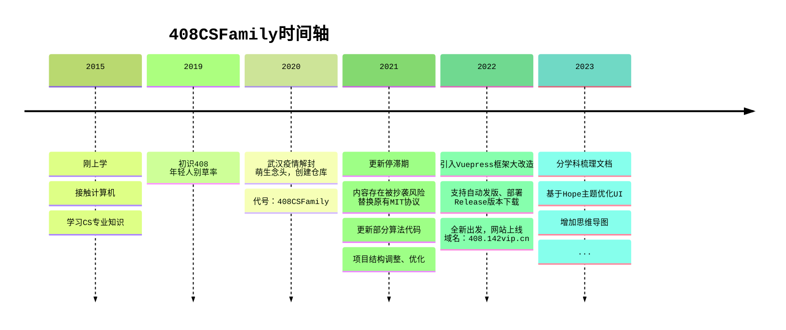

# 网站动态

### 2023.09.05

- 支持Netlify平台托管，地址：<https://408-family.netlify.app>

### 2023.08.20

- 支持Vercel平台托管，地址：<https://408-family.vercel.app>

### 2022.10.17

- 支持Github平台托管，地址：<https://142vip.github.io/408CSFamily>

### 2022.07.01

- 对仓库进行工程化改造，支持PNPM管理依赖，锁定依赖版本

### 2022.06.22

- 大幅新增脚本，支持构建、部署一体化
- 支持容器镜像打包
- Nginx反向代理

### 2021.07.01

- 因开源仓库内容存在被抄袭风险，替换原有证书协议：`MIT协议` --> `GNU GENERAL PUBLIC 协议`

### 2020.06.04

- 广告位，新增字节跳动等公司JD招聘信息

### 2020.08.15

- 收到第一笔赞助，添加赞助感谢列表

### 2020.06.22

- 将仓库设置成`Public`，开源代码和文档

### 2020.04.08

- 武汉疫情解封，疫情期间萌生整理计算机基础知识的想法
- 在Github创建项目，取名`408CSFamily`，寓意为：**计算机408考试全家桶，涵盖各学科知识点。**
