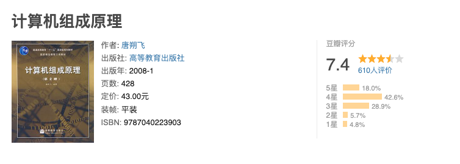
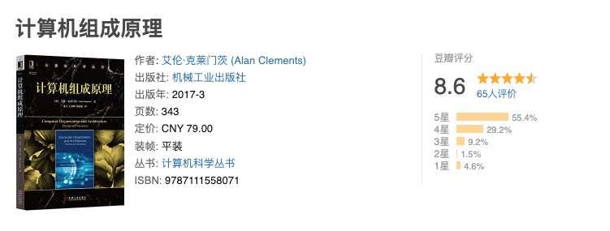

# 计算机组成原理

## 计算机引论

- 发展历程
- 系统层次结构
- 性能指标

## 数据的表示和运算

- 数制和编码
- 定点数
- 浮点数
- 算数逻辑单元

## 存储系统

- 存储器介绍
- 存储器的层次化结构
- 随机存储器
- 主存和CPU
- 双端口RAM和多模块存储器
- 高速缓冲存储器
- 虚拟存储器

## 指令系统

- 指令格式
- 寻址方式
- 指令集

## 中央处理器

- CPU的基本介绍
- 指令执行过程
- 数据通路
- 控制器
- 指令流水线

## 总线

- 总线介绍
- 总线仲裁
- 总线的操作和定时
- 总线标准

## 输入、输出系统

- 基本概念
- 外部设备
- 输入、输出接口
- 输入、输出方式

## 参考资料

- 《计算机组成原理》 第二版 唐朔飞
- 《计算机组成原理-王道考研》 2019 王道论坛
