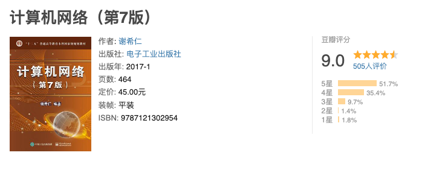
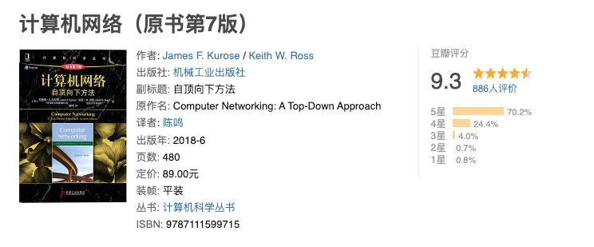

# 计算机网络

## 体系机构

- 基本介绍
- 体系结构与参考模型

## 物理层

- 通信基础
- 传输介质
- 物理层设备

## 数据链路层

- 基本功能
- 组帧
- 差错控制
- 流量控制&可靠传输
- 介质访问控制
- 局域网
- 广域网
- 通信设备

## 网络层

- 基本功能
- 路由算法
- 路由协议
- IPV4
- IPV6
- IP组播&移动IP
- 网络层设备

## 传输层

- 提供的服务
- UDP协议
- TCP协议

## 应用层

- 应用模型
- DNS
- FTP协议
- 电子邮件
- HTTP协议

## 参考资料

- 《计算机网络-第七版》谢希仁著.
- 《计算机网络-王道考研》2019 王道论坛.
