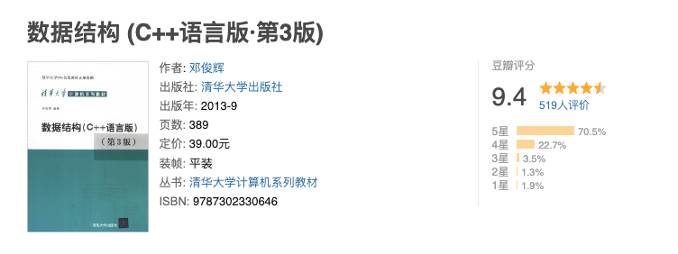
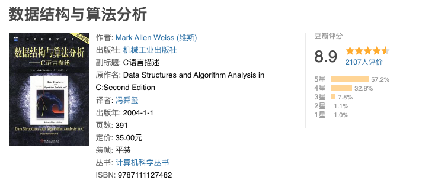

# 数据结构

## 基础入门

- [x] 基本概念
- [x] 数据结构三要素
- [x] 算法和算法评价

## 线性表

- [x] 基础概念和操作
- [x] 顺序表示
- [x] 链式表示
- [x] 一些总结

## 栈

- [x] 基本概念和操作
- [x] 顺序存储结构
- [x] 链式存储结构
- [x] 一些总结

## 队列

- [x] 基本概念和操作
- [x] 顺序存储结构
- [x] 链式存储结构
- [x] 一些总结

## 串

- 基本概念
- 简单的模式匹配
- KMP算法

## 树与二叉树

- 基本概念
- 二叉树
- 二叉树遍历
- 线索二叉树
- 树和森林
- 树的应用

## 图论

- 基本概念
- 图的存储
- 图的遍历
- 图的应用

## 查找

- 基本概念
- 顺序查找
- 折半查找
- B树和B+树
- 散列表

## 排序

- 基本概念
- 插入排序
- 交换排序
- 选择排序
- 归并排序
- 基数排序
- 外部排序

## 参考资料

- 《数据结构》严蔚敏著.
- 《数据结构-王道考研》2019 王道论坛.
