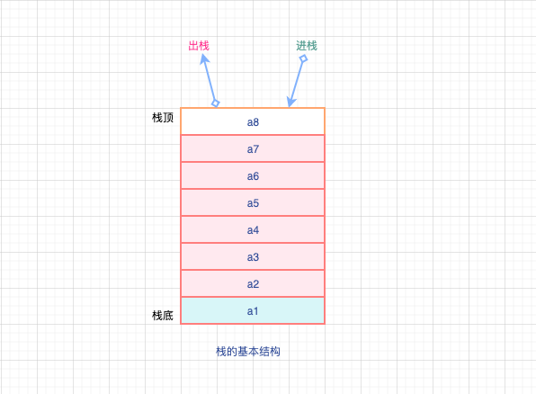

# 栈的基本概念和基本操作

## 基本概念

`栈`： 只允许在一端进行插入或者删除操作的**线性表**，`后进先出的线性表`。

- 明确栈是一种线性表
- 限定栈只能在某一端进行插入或者删除操作

`栈顶`：线性表允许进行插入和删除的一端。

`栈底`：不允许进行插入和删除的另外一端，是**固定的**。类似杯底这中概念

`空栈`：不含任何元素的空表，也叫**栈空**

基本结构如下：

在上面的基本结构中，可以假设存在栈S=(a1,a2,a3,a4,a5,a6,a7,a8),很明显

- 栈顶元素：a1
- 栈底元素：a8

栈只能在栈顶进行插入和删除操作

- 进栈顺序：a1->a2->a3->a4->a5->a6->a7->a8
- 出栈顺序：a8->a7->a6->a5->a4->a3->a2->a1

可以得出结论：栈是后进先出（先进后出），即：LIFO（Last In First Out），也可以叫**后进先出的线性表**

## 基本操作

- `InitStack(&S)`: 初始化一个空栈`S`，栈顶指针初始化为-1
- `StackEmpty(S)`: 判断一个栈是否为空，如果栈空则返回`true`,否则返回`false`
- `Push(&S,x)`: 进栈，若栈未满，`x`进栈操作，插入到栈内成为`新的栈顶元素`。
- `Pop(&S,&x)`: 出栈，若栈非空，出栈操作，**弹出栈顶元素**，用指针`x`进行返回。
- `GetTop(S,&x)`: 读栈顶元素，若栈`S`非空，用x返回栈顶元素。
- `ClearStack(&S)`: 销毁栈，释放栈`S`占用的存储空间。

> Tips: `&`是C++特有的，可以用来表示引用调用，类似`传址目的`，可以类比指针。 当然，在C语言中\*代表指针，指向存储地址，也是具有`传址目的`
