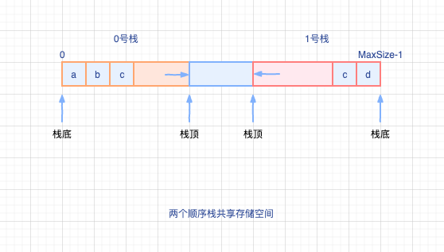

# 栈的顺序存储结构

`顺序栈`：栈的顺序存储，利用一组地址连续的存储单元存放自栈底到栈顶的所有元素，同时**附加一个用来指向当前栈顶位置的指针**

> 指针指向栈顶（top）主要是因为栈在线性表的一端操作，操作的那端就是栈顶，方便操作。

## 顺序栈的存储类型

```cpp
// 定义栈中元素的最大个数
# define MaxSize 50

// 结构体定义
typedef struct{
    ElemType data[MaxSize];     // 存放栈中元素
    int top;                    // 栈顶指针
}SqStack;

```

假设存在顺序栈S，则：

- 栈顶指针：S.top 初始化时设置S.top=-1
- 栈顶元素：S.data[S.top]，其中S.top为栈顶指针
- 进栈操作：栈不满时，栈顶指针+1，再送值到栈顶元素
- 出栈操作：栈非空时，先取栈顶元素值，再将栈顶指针-1
- 栈空条件：S.top=-1
- 栈满条件：S.top=MaxSize-1
- 栈长：S.top+1

> Tips: 进栈先移动指针，避免占满，元素无法添加，出现外溢；出栈先取栈顶元素，保证指针永远指向栈顶。

顺序栈的存储结构体定义可以很明显看出，顺序栈的入栈操作会受到数组上界(MaxSize)的约束。

**当对栈的最大使用空间估计不足时，容易出现栈上溢(外溢)，需要主动向用户报告反馈，避免出现错误；**

## 顺序栈的基本运算

- `InitStack(&S)`: 初始化一个空栈`S`,栈顶指针初始化为-1
- `StackEmpty(S)`: 判断一个栈是否为空，如果栈空则返回`true`,否则返回`false`
- `Push(&S,x)`: 进栈，若栈未满，`x`进栈操作，插入到栈内成为`新的栈顶元素`。
- `Pop(&S,&x)`: 出栈，若栈非空，出栈操作，**弹出栈顶元素**，用指针`x`进行返回。
- `GetTop(S,&x)`: 读栈顶元素，若栈`S`非空，用x返回栈顶元素。
- `ClearStack(&S)`: 销毁栈，释放栈`S`占用的存储空间。

### 初始化

`InitStack(&S)`: 初始化一个空栈`S`,栈顶指针初始化为-1

```cpp
void InitStack(&S){
    // 栈顶指针-1
    s.top=-1;
}

```

### 栈空判断

`StackEmpty(S)`: 判断一个栈是否为空，即：栈顶指针是否为-1，如果栈空则返回`true`,否则返回`false`

```cpp
bool StackEmpty(S){
    if(S.top==-1){
        // 栈空
        return true;
    }else{
        // 栈非空
        return false;
    }
}

```

### 进栈

`Push(&S,x)`: 进栈，若栈未满，`x`进栈操作，插入到栈内成为`新的栈顶元素`。

```cpp
bool Push(SqStack &S,ElemType x){
    if(S.top==MaxSize-1){
        // 栈满，返回false，元素无法进行进栈操作
        return false;
    }else{
        // 可进栈，栈顶指针+1，再元素入栈
        S.data[++S.top]=x;

        // 入栈成功
        return true;
    }
}

```

注意：

- 进栈先移动栈顶指针+1，再操作入栈元素
- `++i`是简写，先对变量i进行递加操作，再进行使用，即：先加后用

### 出栈

`Pop(&S,&x)`: 出栈，若栈非空，出栈操作，**弹出栈顶元素**，用指针`x`进行返回。

```cpp
bool Pop(SqStack &S,ElemType &x){
    if(S.top==-1){
        // 栈空，无栈顶元素可出栈，返回false
        return false;
    }else{
        // 栈非空，先元素出栈，再进行指针-1
        x=S.data[S.top--];

        // 出栈成功，返回true
        return true;
    }
}

```

注意：

- 出栈操作，先让元素出栈，获取栈顶元素，再移动指针-1
- `i--`是先使用变量i，再对变量做递减操作，即：先用后加（减）

### 读（获取）栈顶元素

`GetTop(S,&x)`: 读栈顶元素，若栈`S`非空，用x返回栈顶元素。

```cpp
bool GetTop(SqStack S,ElemType &x){

    if(S.top==-1){
        // 栈空，无栈顶元素,返回false
        return false;
    }else{

        // 通过栈顶指针，获取栈顶元素，赋值给变量x
        x=S.data[S.top];

        // 读取栈顶元素成功，返回true
        return true;
    }
}

```

**上面的这些操作都是基于栈顶指针初始化为`-1`的情况**

当栈顶指针初始化为`S.top=0`,相关操作操作会有区别：

- 入栈： `S.data[S.top++]=x`
- 出栈： `x=S.data[--S.top]`

**同时， 栈空、栈满条件也会有变化，要仔细对比揣摩**

## 共享栈

`共享栈`：利用栈底位置相对不变的特性，可以让两个顺序栈共享一个`一维存储空间`，将两个栈的栈底分别设置在共享空间的两端，两个栈顶则向共享空间的中间延伸

> Tips: 类似头对头，一致对外这种感觉，噗呲哈哈



在上面的共享栈结构图中，两个栈（0、1号顺序栈）的栈顶指针都指向栈顶元素

- 0号栈栈顶指针`top=-1`时，0号栈为空
- 1号栈栈顶指针`top=MaxSize`时，1号栈为空

当且仅当两个栈的栈顶指针相邻(`top1-top0=1`),可以判断共享栈栈满

### 进栈

> 进栈：先移动指针，后进行赋值

- 当0号栈进栈时，0号栈栈顶指针top0`先加1后赋值`
- 当1号栈进栈时，0号栈栈顶指针top1`先减1后赋值`

### 出栈

> 出栈：先进行赋值，后移动指针

- 当0号栈进栈时，0号栈栈顶指针top0`先赋值后减1`
- 当1号栈进栈时，0号栈栈顶指针top1`先赋值后加1`

共享栈能够更有效的利用存储空间，两个栈空间进行相互调节。只有当这个存储空间（即：共享空间）被占满时才会发生上溢。存取数据的时间复杂度都为O(1)，在栈顶操作。

**共享栈对存取效率没有什么影响**
