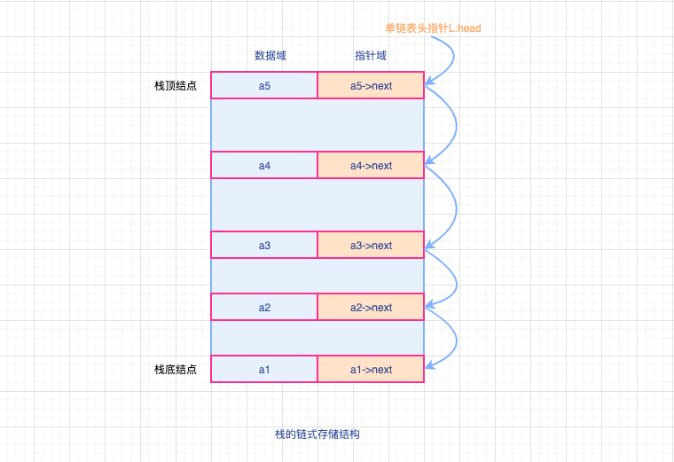

# 栈的链式存储结构

`链栈`： 采用链式存储的栈

`栈满`：对于链栈来说，是基于链式存储的，基本不存在栈满的情况，除非内存已经没有使用空间了。

`栈空`：对于空栈来说，链表原来的定义是头指针指向空，那么链栈的空其实就是`top＝NULL`,链栈元素总数为0

栈只是栈顶在做插入和删除操作，栈顶应该放在单链表的头部，所以单链表中的头结点也就失去了意义。

**通常对于链栈来说，是不需要头结点的，当然也存在带头结点的链栈**



栈的链式存储类型：

```cpp
// 链栈类型定义【基础】
typedef struct LinkNode{
  ElemType data;                // 栈元素结点数据域
  struct LinkNode *next;        // 栈元素结点指针域
} *LinkStack;

// 更为详细的定义

typedef struct StackNode
{
 int data;//结点数据域
 struct StackNode* next;//结点指针域
}StackNode,* Linktop;

//链栈的数据结构
typedef struct LinkStack
{
 Linktop top;   //栈顶结点,定义了一个指向上个结构体的指针
 int count;//元素个数
}LinkStack;

```

优点：

- 便于多个栈共享存储空间
- 不存在栈满上溢的情况，避免程序因溢出导致出错
- 有效的提高存取效率

## 进栈

- 如果链栈不存在，则栈满，入栈操作失败，返回false;
- 如果链栈存在，进行单链表的结点插入操作，移动指针，结点元素赋值，再将结点压入链栈中，移动链栈栈顶指针，最后链栈元素总数+1，返回true

```cpp
/*
 * @Description: 基于单链表链栈的进栈操作
 * @Version: Beta1.0
 * @Author: 微信公众号：储凡
 * @Date: 2020-03-04 07:36:04
 * @LastEditors: 微信公众号：储凡
 * @LastEditTime: 2020-03-04 11:39:16
 */
bool linkStackPushNode(LinkStack* linkStack,int e){

  // 判断链栈是否存在
  if (!linkStack){
     //链栈不存在，无法进栈操作，返回false
   return false;
  }
  // 开辟栈结点元素内存控件
  StackNode* node = (StackNode*)malloc(sizeof(StackNode));
  // 新结点指针域指向链表，即栈顶指针位置，元素加入链表
  node->next = linkStack->top;
  // 新结点数据域赋值
  node->data = e;
  // 元素进栈，移动栈顶指针，指向新入栈的元素
  linkStack->top = node;
  // 链栈元素总数+1
  linkStack->count++;
  //链栈入栈成功，返回true
  return true;
}
```

## 出栈

- 如果链栈不存在，或者为空栈，则无法进行出栈操作，返回false
- 如果链栈满足出栈条件，则通过栈顶指针获取到链栈栈底结点，将其数据域赋值给变量e，移动栈顶指针指向待出栈元素的后继结点，同时释放待出栈元素的内存空间，链栈元素总数-1 ，出栈成功，返回true.

```cpp
/*
 * @Description: 基于单链表链栈的出栈操作
 * @Version: Beta1.0
 * @Author: 微信公众号：储凡
 * @Date: 2020-03-04 23:38:04
 * @LastEditors: 微信公众号：储凡
 * @LastEditTime: 2020-03-04 23:39:16
 */
bool linkStackPopNode(LinkStack* linkStack,int *e){
  // 判断链栈是否存在及是否为空
  if (!linkStack || linkStack->count==0){
    //出栈失败，返回false
   return false;
  }
  // 获取栈顶元素结点
  StackNode* node = stack->top;

  // 结点元素数据域赋值给变量e
  *e = linkStack->data;
  // 移动栈顶指向，栈顶指针指向待出栈结点的后继结点
  linkStack->top = node->next;
  // 变量e已被赋值，释放链栈出栈元素的内存控件
  free(node);
  // 链栈元素个数-1
  linkStack->count--;
  // 出栈成功，返回true.
  return true;
}

```

以上是基于单链表的链栈入栈、出栈操作，很明显**时间复杂度都为O(1）**,重点`注意移动指针，保持不断链`
