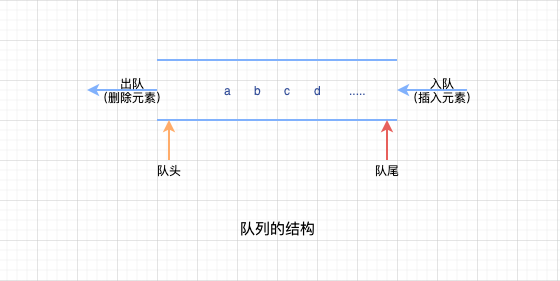

# 队列的基本概念和操作

## 基本概念

`队列`：和栈一样，是一种操作受限制的线性表,只允许在表的一端进行插入，在表的另外一端进行删除，简称为`队`，常记作：`Queue`

`入队`： 向队列中插入元素，也叫做`进队`

`出队`： 删除队列元素，也叫做`离队`

结合生活中排队的经验，在群体素质高、无人插队的情况下(`薛定谔排队`,噗呲，哈哈哈),**一般最早排队的也是最早离队的**，和栈的`后进先出`不一样的是，队列是`先进先出`的，即：First In Frist Out

> Tips
>
> - 栈：又叫做后进先出的线性表
> - 队列：又叫做先进先出的线性表

`队头`：允许进行删除操作的一端，也叫做`队首`，常记作：`Front`

`队尾`：允许进行插入操作的一端，常记作：`Rear`

`空队列`：不含任何元素的空表，注意这个表是指`线性表`

## 基础操作

> 和栈一样，队列是操作受限的线性表，具有`先进先出`的特性，不是任何对线性表的操作都可以作为队列的操作。例如：无法随便读取到队列中间的某个数据，需要将前面的元素先出队

- `InitQueue(&Q)`： 初始化一个队列，构造空队列Q
- `QueueEmpty(Q)`： 判断队列是否为空，队空返回true,否则返回false
- `EnEmpty(&Q,x)`： 入队，如果队列Q未满，将x入队，成为新的队尾元素
- `DeEmpty(&Q,&x)`： 出队，如果队列Q非空，删除队头元素，复制给x返回
- `GetHead(Q,&x)`： 读取队头元素，如果队列Q非空，则将队头元素赋值给x
