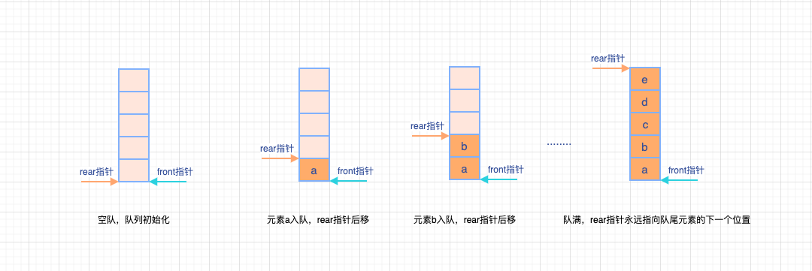
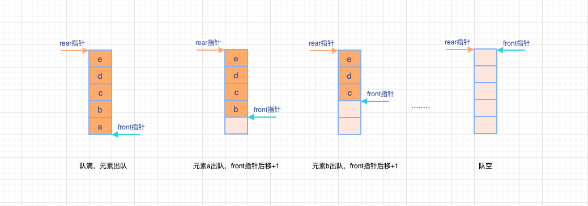
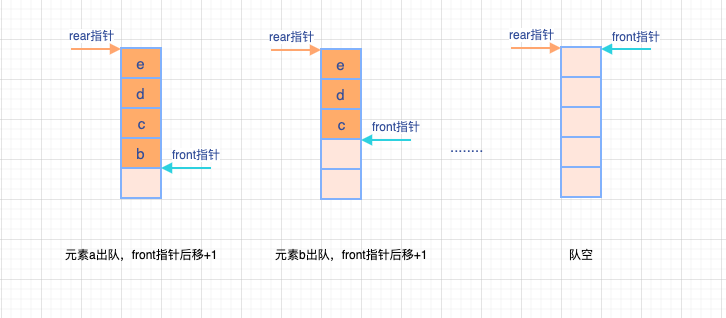
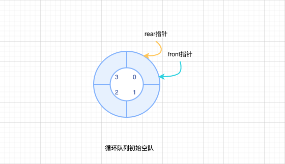
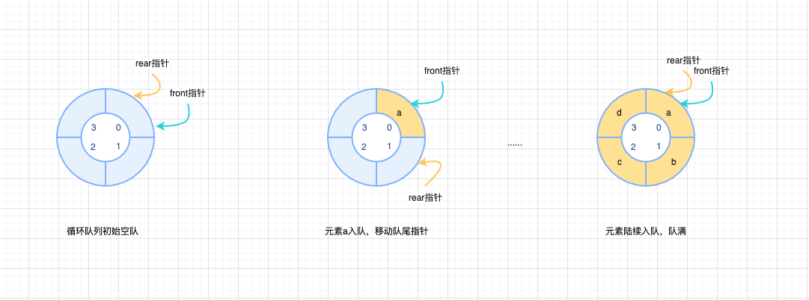

# 队列的顺序存储结构

> 队列的顺序实现是指分配一块连续的存储单元用来存放队列中的元素，并且附加两个指针。
>
> - `front指针`： 指向队头元素的位置
> - `rear指针`： 指向队尾元素的位置

队列顺序存储类型：

```cpp
// 队列最大存储元素个数
#define MaxSize 50

// 结构体定义
typedef struct {
  // 存放队列元素
  ElemType data[MaxSize];
  // 队头指针和队尾指针
  int front,rear;
} SqQueue;
```

假定：

- 队头指针指向队头元素
- 队尾指针指向队尾元素的下一个位置

则：

- 初始状态（**队空条件**）：`Q.front`===`Q.rear`===0
- 入队操作：队不满时，先赋值给队尾元素，再移动队尾指针+1
- 出队操作： 队不空时，先取队头元素值，再移动队头指针+1



在空队列中，初始状态为`Q.front===Q.rear==0`,当元素a入队时,队尾指针rear后移+1，入队成功后，`Q.front==0`、`Q.rear==1`，在队不满的情况下进队，都是`先赋值给队尾元素，再移动队尾指针rear+1`,通过上面的图宝贝可以看到，队列被元素打满的时：

- 在这个进队的过程中，没有元素出队，队头指针并没有做改变，`Q.front==0`
- 进队操作直接影响队尾指针的变化，队列满的时候`Q.rear==Maxsize`

> Tips: MaxSize为队列结构体定义中，最大存储元素个数哦~



进队说完了，那给宝贝来说说出队吧。以上图为例，队列中`Q.rear==Maxsize`、`Q.front==0`；当出现元素在队首出队，就会直接影响队首指针，从上面的流程上看：

- 元素出队，front指针后移+1，在队不空的情况下，操作为：`先取队头元素值，再移动队头指针+1`

- 当队列中的元素都陆续出队，抛弃了宝贝（都是渣男，噗呲，哈哈哈），指针会是：`Q.rear==Q.front==MaxSize`

从上面两张图中，我们来思考：

> 前面队空条件为：`Q.front===Q.rear===0`,那能用`Q.rear==MaxSize`来表示队满嘛？

傻瓜，你在瞅瞅前面的图，明显存在`Q.rear==MaxSize`，但队列确实空的情况呀。队满要灵活判断，可不要死记书上总结的。书上说的很多结论都是有前提的，老师记结论不记前提容易张冠李戴、含糊不清的呀~

很显然，也存在下面这种情况：

- 队头指针指向队头元素的前一个位置
- 队尾指针指向队尾元素

此时的入队、出队过程就宝贝自己去画流程图咯

## 循环队列

在上面的顺序队列中，当队满后进行出队列，由于顺序队列出队只在队首进行操作，并且只会修改队首指针，这时候就会出现队尾指针一直`Q.rear===MaxSize`情况，就如下：



可以很明显的看到，明明队列不满，但是由于进队列只能在队尾操作，因此不能进行进队操作；通常在这种情况下入队就会出现“上溢出”。

> 需要明确的是：上溢出并不是真正的溢出，只是表明在顺序队列中队不满却无法入队的情况，是一种假的”溢出“

这种情况在顺序队列中是非常常见的，也是顺序队列的一大缺点。为了克服这个缺点，计算机先贤们总是能够有很多很好的办法，这里不得不佩服！！，所以就有了循环队列，**一个将顺序队列臆想为一个环状的空间**

> 很多时候就是这样，为了解决一个问题，从而衍生出一个新的知识

`循环队列`：把顺序队列臆想为一个环状的空间，将存储队列元素的表从逻辑上看做为一个环



当队首指针`Q.front=MaxSize-1`后，再有元素`出队`就前进一个位置自动到位置0了【注意：可以结合时钟来理解，一圈转完了】

- 初始时：`Q.front=Q.rear=0`
- 队首指针进1： `Q.front=(Q.front+1)%MaxSize`
- 队尾指针进1： `Q.rear=(Q.rear+1)%MaxSize`
- 队列长度： `(Q.rear+MaxSize-Q.front)%MaxSize`

> 是不是理解起来有点抽象，其实我最开始学到这里的时候，也不明白为什么要用`除法取余运算（%）`来实现。后来我看看了手机上的时钟指针，一圈两圈三圈的转，好像就开始悟了...其实这种取余操作在计算机知识体系中还是非常常见的，例如：组成原理中将会学到的补码，据说idea就是来源于时钟..

**和时钟一样，顺时钟进行时间变换，在出队、入队时，队首、队尾指针都是按顺时针方向进1**



如上图，循环队列从最开始初始化为空队列时:`Q.front==Q.rear==0`,经过元素a入队，队尾指针顺时针前移`Q.rear+1`，到元素a、b、c、d陆续入队，就好像时钟转完了一圈，循环队列已满，此时发现：`Q.front==Q.rear==0`在队满时候依然成立，所以结合前面提到的初始化对空条件:`Q.front==Q.rear==0`,用`Q.front==Q.rear`来区分`队空`和`队满`是非常不合适的。

### 如何区别队空还是队满

> 为了很好的区别循环队列的`队空`还是`队满`的情况，一般有三种处理方式.

#### 牺牲一个单元来区分队空和队满

这种方式**要求在入队时少用一个队列单元**，是一种比较普遍的做法。约定：

**队头指针在队尾指针在队尾指针的下一个位置作为队满标志【重要】**

- 队满条件：`(Q.rear+1)%MaxSize==Q.front`
- 队空条件：`Q.front==Q.rear`
- 队列中元素个数：`(Q.rear+MaxSize-Q.front)%MaxSize`

#### 类型中增设表示元素个数的数据成员

这种就很直接了，直接和MaxSize去比较，就可以有：

- 队空条件： `Q.count=0`
- 队满条件： `Q.count=MaxSize`

值的注意的是：在这个前提下，不论是`队空`还是`队满`，对会存在`Q.front=Q.rear`,这个可以通过前面方案解决。

#### 类型中增设tag数据成员标记

通过添加tag标记的方式，区分`队空`还是`队满`

- `tag==0`的情况下，如果因为删除导致`Q.front==Q.rear`，则队空；
- `tag==1`的情况下，如果因为插入导致`Q.front==Q.rear`，则队满；

可能你会对上面的这两种情况有迷惑，说实话我第一次看的时候，也挺迷惑的，这里我按照我的理解来解释一下：

> 在循环队列中增加tag数据成员标记，tag的主要作用：
>
> - 在有元素入队的时候，设置tag=1
> - 在有元素出队的时候，设置tag=0

对应的算法实现：

```cpp
// 入队算法
// 尾插法：Q.data[Q.rear]=x;Q.rear=(Q.rear+1)%Maxsize;Q.tag=1
// 队空条件：Q.front== Q.rear且Q.tag==0
int EnLoopQueue(SqQueue &Q, ElemType x){
   if(Q.front==Q.rear&&Q.tag==1){
      return 0;
   }
   Q.data[Q.rear]=x;
   Q.rear=(Q.rear+1)%MaxSize;
   Q.tag=1;
   return 1;
}

// 出队算法
// 头结点删除：x=Q.data[Q.front];Q.front=(Q.front +1)%Maxsize;Q.tag=0
// 队满条件：Q.front == Q.rear且Q.tag=1
// 注意：当删除之后链表为空时，还需增加一步，将尾指针指向头结点
int DeLoopQueue(SqQueue &Q, ElemType &x){
    if (Q.front==Q.rear&&Q.tag==0){
        return 0;
    }
    x=Q.data[Q.front];
    Q.front=(Q.front+1)%MaxSize;
    Q.tag=0;
    return 1;
}

```

## 代码实现

### 初始化空队列

```cpp
/*
 * @Description: 循环队列初始化，队列为空
 * @Version: Beta1.0
 * @Author: 微信公众号：储凡
 * @Date: 2019-09-27 14:17:28
 * @LastEditors: 微信公众号：储凡
 * @LastEditTime: 2021-03-18 22:15:06
 */
void InitLoopQueque(&Q){
  Q.front=Q.rear=0;
}
```

### 队列是否为空

```cpp
/*
 * @Description: 判断循环队列是否为空
 * @Version: Beta1.0
 * @Author: 微信公众号：储凡
 * @Date: 2019-09-27 14:17:28
 * @LastEditors: 微信公众号：储凡
 * @LastEditTime: 2021-03-18 22:15:06
 */
bool isEmpatyLoopQueue(Q){
  // 注意循环队列对空条件：Q.rear=Q.front
  if(Q.rear=Q.front){
    // 队空
    return true;
  }else{
    // 非空
    return false;
  }
}

```

### 入队操作

```cpp
/*
 * @Description: 循环队列元素入队
 * @Version: Beta1.0
 * @Author: 微信公众号：储凡
 * @Date: 2019-09-27 14:17:28
 * @LastEditors: 微信公众号：储凡
 * @LastEditTime: 2021-03-18 22:15:06
 */
bool EnLoopQueue(SqQueue &Q, ElemType x){
  // 判断循环队列是否已满 注意判断条件：(Q.rear+1)%MaxSize===Q.front
  if((Q.rear+1)%MaxSize===Q.front){
    // 循环队列满
    return false;
  }
   // 队列未满，可进行入队操作【队尾进行】

   // 队尾指针指向的数据域进行赋值
   Q.data[Q.rear]=x;

   //队尾指针后移+1【类似时钟的顺时针方向】
   Q.rear=((Q.rear+1)%MaxSize);

   // 入队成功，返回true
   return true;
}

```

### 出队操作

```cpp
/*
 * @Description: 循环队列元素出队
 * @Version: Beta1.0
 * @Author: 微信公众号：储凡
 * @Date: 2019-09-27 14:17:28
 * @LastEditors: 微信公众号：储凡
 * @LastEditTime: 2021-03-18 20:32:18
 */
bool DeLoopQueue(SqQueue &Q, ElemType &x){

  // 判断循环队列是否为空队列
  if(Q.rear==Q.front){

    // 队列为空，无法进行出队操作，返回false
    return false;
  }

  // 循环队列非空,元素可出队【队首操作】

  // 将循环队列队首指针指向的元素的数据域赋值给变量x
  x=Q.data[Q.front];

  // 移动队首指针，顺时针后移+1
  Q.front=(Q.front+1)%MaxSize;

  // 出队成功，返回true
  return true;
}

```

### 获取队头元素

```cpp
/*
 * @Description: 获取循环队列队头元素
 * @Version: Beta1.0
 * @Author: 微信公众号：储凡
 * @Date: 2019-09-27 14:17:28
 * @LastEditors: 微信公众号：储凡
 * @LastEditTime: 2021-03-18 20:15:33
 */
bool GetLoopQueueHead(SqQueue &Q, ElemType &x){
    // 判断循环队列是否为空队列
    if(Q.front==Q.rear){
      // 队列为空，没有队头元素，返回false
      return false;
    }else{
      // 获取队头指针指向元素的数据域，赋值给x
      x=Q.data[Q.front];

      // 获取队头元素成功，返回true
      return true;
    }
}
```
