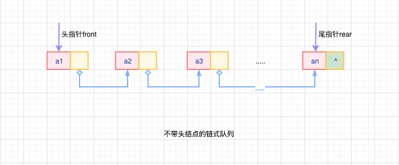
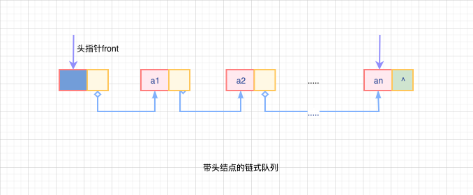
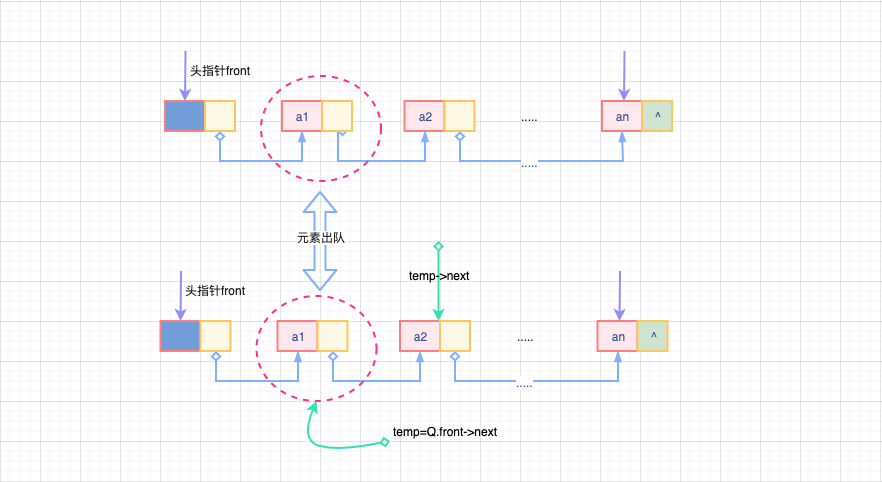
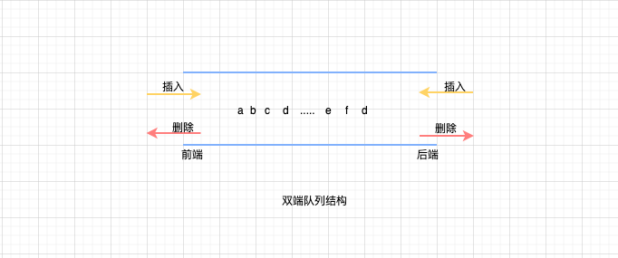

# 队列的链式存储结构

`链队列`：和顺序队列一样，基于队列的链式表示叫做`链队列`，实际上为：**一个同时带有队头指针和队尾指针的单链表**

- 头指针指向队头结点
- 尾指针指向队尾结点（单链表的最后一个结点）

这里复习下顺序队列的定义，进行比较学习

> 队列的顺序实现是指分配一块连续的存储单元用来存放队列中的元素，并且附加两个指针。
>
> - 队头指针指向队头元素
> - 队尾指针指向队尾元素的下一个位置



队列的链式存储结构：

```cpp
// 链式队列节点定义
typedef struct{
  // 结果点数据域
  ElemType data;
  // 结点指针域
  struct LinkNode *next;
}LinkNode;

// 链式队列定义
typedef struct{
  // front 队头指针，rear 队尾指针
  LinkNode *front,*rear;
}LinkQueue;

```

结合上面的`不带头结点`链式队列结构图，假设存在链式队列<LinkQueue,linkQueue>

- 队空： `linkQueue.front==NULL`且`linkQueue.rear==NULL`
- 出队： 先判断队列是否为空，非空队列则取出队头元素，从链表中闪出去，`队头指针Q.front指向下一个结点`，如果出队的结此为尾结点，出队后队空，需要将Q.front和Q.rear都置为NULL
- 入队： 建立一个新的结点，将新的结点插入到链表的尾部，修改队尾指针Q.rear指向新插入的结点。如果原队列为空，需要将队首指针也指向该结点

仔细思考上面的入队、出队操作，都需要考虑队空的情况下的特殊处理，不带头结点的队列导致队空队首和队尾指针都为NULL，比较麻烦；结合之前整理、学习过的单链表，套用一下先贤的思路，也整上一个头结点，就会发现容易处理很多；



链式队列加上头结点后，之前较为复杂的入队、出队操作就统一起来了。

- 队空：`Q.front==Q.rear`,都指向头结点，一般数据域可以为空
- 出队：判断队列是否为空，队列非空则在队首移动指针，将队首指针指向下一个元素。如果队列中就一个元素，则出队后将成为空队，`Q.rear==Q.front`,最后释放元素内存空间。
- 入队：将元素插入队尾，移动队尾指针，即便为空队列入队，由于队列带有头结点，此时就很好的避免操作队首指针了。

特别注意：

- 用单链表表示的链式队列非常适合频繁出队、入队、元素变化大的场景
- 不存在队满情况，也不会出现溢出情况；
- 链式队列不会出现存储分配不合理、“溢出”的情况，内存动态分配

## 基本操作

> Tips: 基于带头结点链式队列的基础操作

### 队列初始化

```cpp
/*
 * @Description: 链式队列初始化
 * @Version: Beta1.0
 * @Author: 微信公众号：储凡
 * @Date: 2020-06-27 14:17:28
 * @LastEditors: 微信公众号：储凡
 * @LastEditTime: 2021-02-18 22:15:06
 */
voide InitLinkQueue(LinkQueue &Q){

  // 创建头结点
  Q.front=Q.rear=(LinkNode*)malloc(sizeof (LinkNode));

  // 头结点的指针域指向的下一个结点为空
  Q.front->next=NULL;
}
```

注意这个初始化操作，我第一次看的时候，非常不理解为什么在队首指针和队尾指针都指向已经创建好的头结点后，突然写一行`Q.front->next=NULL;`,后来的的理解是：

> 链式队列，本质是基于单链表的队列，那带头结点的链式队列，其实强调的也就是单链表要带头结点。队列的队首指针和队尾指针确定指向单表的队首和队尾就ok；初始化的时候，带头结点的单链表实质就只有一个头结点。而此时的链式队列，需要将队首指针和队尾指针指向单链表的头结点就行，好像到这里就完了。但是这样却忽视了单链表，只是注重的队列的front和rear指针。单链表的结点元素是分数据域和指针域的，即便是头结点的数据域可以不存什么（当然也常会存一些链表信息什么的）,此处的`Q.front->next=NULL`就是用来处理链表的头结点的指针域的，让其指向下一个单链表元素为空，这里是非常需要处理的，非常细节！

### 判断队空

```cpp
/*
 * @Description: 判断链式队列是否为空
 * @Version: Beta1.0
 * @Author: 微信公众号：储凡
 * @Date: 2020-06-27 14:24:22
 * @LastEditors: 微信公众号：储凡
 * @LastEditTime: 2021-02-16 22:15:06
 */
bool IsEmptyLinkQueue(LinkQueue Q){
  if(Q.front==Q.rear){
    // 队首、队尾指针指向同一个结点内存地址，队空
    return true;
  }else{
    // 非空
    return false;
  }
}
```

### 入队

```cpp
/*
 * @Description: 链式队列入队操作
 * @Version: Beta1.0
 * @Author: 微信公众号：储凡
 * @Date: 2020-06-46 14:17:28
 * @LastEditors: 微信公众号：储凡
 * @LastEditTime: 2021-02-18 22:15:06
 */
void EnLinkQueue(LinkQueue &Q, ElemType x){

  //创建入队结点元素
  node=(LinkNode *)malloc(sizeof(LinkNode));

  // 赋值给结点数据域
  node->data=x;
  // 单链表中结点的指针指向下一个元素，为空
  node->next=NULL;

  // 队尾进队，将结点node和队尾结点链接起来，确保不断链
  Q.rear->next=node;
  // 修改队尾指针，指向新入队的结点node
  Q.rear=node;
}

```

### 出队

```cpp
/*
 * @Description: 链式队列出队操作
 * @Version: Beta1.0
 * @Author: 微信公众号：储凡
 * @Date: 2020-05-18 11:25:28
 * @LastEditors: 微信公众号：储凡
 * @LastEditTime: 2021-02-22 06:15:06
 */
bool DeLinkQueue(LinkQueue &Q, ElemType &x){

  // 判断队列是否为空
  if(Q.front==Q.rear){
    // 队列为空，没有元素出队
    return false;
  }

  // Q.front指向单链表的头结点，出队需要出单链表的除头结点外的第一个结点（头结点的下一个结点：Q.front->next）
  temp=Q.front->next;

  // 变量x赋值
  x=temp->data;

  // 修改单例表的头指针，指向链表中待删除元素的下一个元素
  Q.front->next=temp->next;

  // 队尾指针和队首指针的下一个结点重合，表示当前链式队列只有一个元素，删除后，队列为空
  if(Q.rear==temp){
    // 链表中队首、队尾指针重合，队列为空
    Q.rear=Q.front;
  }

  // 释放删除元素的内存空间,注意，这里释放的是头结点的下一个结点
  free(temp);

  // 出队成功
  return true;
}

```

出队的时候明显有些绕，需要明确队列中头结点的存在，出队出的是单链表中头结点的后一个结点，同时要确保整个过程`不断链`



## 双端队列

`双端队列`: 允许在两端都可以进行入队和出队操作的队列，元素的逻辑结构仍然是线性结构



**双端队列的两端分别称为`前端`和`后端`，两端都可以`入队`和`出队`**

- 进队：前端进的元素排列在队列中后端进的元素的前面，后端进的元素排列在队列前端进的元素后面;
- 出队：无论是前端还是后端出队，先出的的元素排列在后出的元素的前面

在双端队列的基础上，还衍生出：

- `输入受限的双端队列`：允许在一端进行插入和删除操作，但在另外一端只允许进行删除的双端队列
- `输出受限的双端队列`：允许在一端进行插入和删除曹组，但在另外一端只允许进行插入的双端队列

当然，如果`限定双端队列从某个断点插入的元素只能从该端点删除`，那么此时的双端队列就演变为两个栈底相邻的栈了。

## 知识补充

- 最适合用来链队的链表是：`带队首指针和队尾指针的非循环单链表`

- 栈和队列的逻辑结构都是线性表，存储结构可能是顺序的（顺序栈、顺序队列），也可能是链式的（链栈、链队）
- 不论是顺序存储还是链式存储，**栈和队列都只能进行顺序存取（本质是线性表）**。数组是可以做到随机存取（本质是顺序表）
- 队列先进先出的特性：`先进队列的元素先出队列，后进队列的元素后出队列`

特别注意：

队列用链表形式存储时，删除元素，需要从队头删除，一般情况下，仅仅修改头指针,但是如果此时队列中
仅有一个元素，则尾指针也是需要被修改的。**因为队列中只有一个元素时，删除后队列为空，需要修改尾指针为：`rear=front`**
