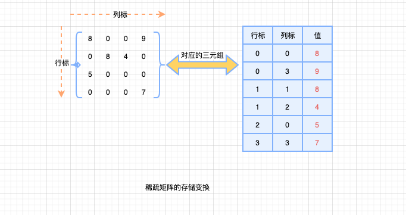

# 栈VS队列补充

> Tips: 这里不会做过多文字介绍相关应用，具体需要自己看书、查资料揣摩

```mindmap
root(栈VS队列补充)
    (栈的应用)
    (队列的应用)
    (数组的定义)
    (矩阵的压缩存储)
```

## 栈的应用

- 括号匹配
- 表达式求值

> 表达式求值是程序设计语言编译中一个最基本的问题，类似有前缀、中缀、后缀表达式转换等典型问题。

- 递归

这里重点总结下递归，递归非常重要，是一种很经典的程序设计方法

> 递归的简单定义： 如果在一个函数、过程或数据结构的定义中又应用了自身，那么这个函数、过程或者数据结构称为递归定义的，简称递归。

递归通常把一个大型的复杂问题，层层转化为一个与原问题相似的规模较小的问题来求解。

**递归策略只需要少量的代码就可以描述出解题过程所需要的多次重复的计算，很大程度上减少了程序的代码量，当时通常情况下，递归的效率并不是很高**

经典的斐波拉切数列，可以用递归来实现：

```cpp
// 定义递归函数，实现斐波拉切数列

int Fibonacci(n){
    if(n==0){
        return 0;
    }else if(n==1){
        return 1;
    }else{
        // 调用Fibonacci函数，进行递归
        return Fibonacci(n-1)+Fib(n-2);
    }
}

```

上面很基础的代码，是分`n=0`和`n=1`的情况，先进行过滤，其他情况下则进行递归，其实在日常开发中，经常会有简化的函数封装

```cpp
// 定义递归函数，实现斐波拉切数列

int Fibonacci(n){
    if(n<2){
        return n;
    }else{
        // 调用Fibonacci函数，进行递归
        return Fibonacci(n-1)+Fib(n-2);
    }
}

```

上面的简化，则需要程序考虑变量n是整数。

当然，前面有说道：**通常情况下，递归的效率并不搞**，主要原因就是递归通过返回调用自己本身，导致往往时间复杂度较高。

可以采用空间换时间的思路，来降低算法的时间复杂度

```cpp
// 使用非递归实现
int Fibonacci(int n) {
        if(n < 2)
            return n;
        int f = 0, g = 1;
        int result = 0;

        // 迭代
        for(int i = 1; i < n; i++){
            result = f + g;
            f = g;
            g = result;
        }
        return result;
}

// 利用数组，空间换时间
int Fibonacci(n){
    // 注意溢出
 int arr[100]={0,1,1}

 // 叠加，结果存放在数组中
 for(let i=3;i<=n;i++){
  arr[i]=arr[i-1]+arr[i-2]
 }
 return arr[n]
}

```

必须注意递归模型不能是循环定义的，满足条件：

- 递归表达式（递归体）
- 边界条件（递归出口），即：算法结束条件

递归的精髓在于是否能够将原来的问题转化为属性相同但规模较小的问题。有点类似实现目标过程中，将大目标转化为小目标（1亿....）来解决,噗呲啊哈哈哈

**递归次数过多容易造成栈溢出，效率不高的主要原因是递归调用过程中包含很多重复的计算**

## 队列的应用

- 层次遍历

> 例如：二叉树的遍历

- 计算机系统

队列在计算机系统中的应用非常广泛，作用：

- 解决主机和外部设备之间速度不匹配的问题（例如：内存和打印机）
- 解决由多用户引起的资源竞争问题（例如：操作系统中的进程调度...）

其实，队列在计算机系统的中应用， 在看完操作系统那本书后，就会很好理解，建议学到这里，也去翻翻操作系统，汤晓丹那本很经典哟...

## 特殊矩阵的压缩存储

> 这部分知识我个人觉得以了解为主，复习、学习的时候还是要以前面的部分为主！

矩阵在`计算机图形学`、`工程计算`中占有举足轻重的地位。

### 数组的定义

`数组`： 由n(n≥1)个相同类型的数据元素构成的有限序列。

每个数据元素称为一个数组元素，同时每个元素受n个线性关系的约束，**每个元素在n个线性关系中的序号称为元素的`下标`**，称为该数组为n的数组。

数组和线性表的关系：

- 数组是线性表的推广。
- 数组一旦被定义，维数和维界就不再改变。
- 除了结构的初始化和销毁外，数组只会有存取元素和修改元素的操作。

一维数组可以看做是一个线性表

二维数组可以看做元素是线性表的线性表

....

### 矩阵的压缩存储

`压缩存储`：多个值相同的元素只分配一个存储空间，对零元素不分配存储空间---->节省存储空间。

`特殊矩阵`：具有很多相同矩阵元素或零元素，并且这些相同矩阵元素或零元素的分布有一定规律性的矩阵。

- 对称矩阵
- 上、下三角矩阵
- 对角矩阵（带状矩阵）
- ....

这里如果学过线性代数这本书，其实也就很好理解（赶紧去把数学知识捡起来鸭，噗呲哈哈啊哈）

`稀疏矩阵`：矩阵元素个数s相对于矩阵中非零元素的个数t来说非常多、差距非常大，即`s>>t的矩阵`可以叫`稀疏矩阵`

注意：

- 常规方法来存储稀疏矩阵，会想当浪费存储空间，所以稀疏矩阵只需要存储非零元素
- 通常非零元素的分布是没有规律的，除了存储非零元素外，还需要存储元素所在位置的行和列
- 寻相互存储三元组 `<行标，列表，值>`



三元组的结点存储了行标(row)、列表(col)、值(value)三种信息，是主要用来存储稀疏矩阵的一种数据结构。

**注意：矩阵压缩存储的目的就是为了节省空间，已经存过的就不存或者少存（经典想法）**
