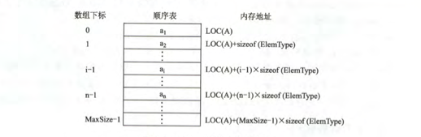
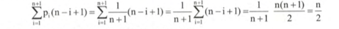
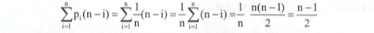

# 顺序表示

## 定义

`顺序表`：顺序存储的线性表，**是用一组地址连续的存储单元，依次存储线性表中的数据元素，使得在逻辑上相邻的两个元素在物理位置上也相邻。**



顺序表中的元素的逻辑顺序与实际的物理位置相同

注意：

- 线性表中的元素的位序是从1开始的，例如1、2、3...
- 数组中的元素的下标是从0开始的，例如0、1、2...

```c
# define MaxSize 20         // 定义常量MaxSize 用来声明顺序表的最大长度

// 线性表结构体定义【ElemType用来代指顺序表中元素的类型，例如高级语言中的int、string....】
typedef struct{
    ElemType data[MaxSize];     // 顺序表的元素
    int length;                 // 顺序表的长度
}SqList

```

### 存储分配

`静态分配`：数组的大小和空间都是实现确定好的，一旦存储空间占满就会产生溢出，直接导致程序崩溃。（有点内存不够，宕机重启的意思....）

`动态分配`：存储数据的空间在程序执行过程中通过`动态存储分配语句`分配的，即便是数据空间占满，也可以另外开辟一块更大的空间，来替换原来的存储空间，满足扩充数据空间的目的。（有点动态规划的意思....）最重要的是：**不需要像静态分配那样，一次性地固定线性表的空间和大小**

```c
#define InitSize 100    // 表长度初始化

// 动态分配数组顺序表的结构体定义
typedef struct{
    ElemType *data;             // 动态分配数组的指针
    int MaxSize,length;         // 数组的最大容量和当前元素个数
}SqList;

```

动态分配语句

```C
// C语言中

L.data=(ElemType*)malloc(sizeof(ElemType)*InitSize);

// C++ 中

L.data=new ElemType[InitSize];

```

`malloc()函数`： 指针型函数，返回的指针指向该分配域的开头的位置。作用是在内存的动态存储区中分配一个长度为size的连续空间。[百度百科](https://baike.baidu.com/item/malloc%E5%87%BD%E6%95%B0/8582146?fr=aladdin)

**动态分配不是链式存储，而是属于顺序存储结构**，动态分配的物理结构没有改变，依然是随机存取的方式。只是分配的空间大小可以在运行时决定；

### 顺序表的特点

- 随机访问【这是最主要的特点】，通过存储起始地址和元素序号O(1)时间内访问指定元素。
- 存储密度高，没有结点只存储数据元素，不像索引存储那样，还需要索引表什么的..
- 逻辑上相邻的元素物理上也相邻，插入和删除需要移动大量元素

## 基本操作

### 插入

在顺序表L的第i（1≤i≤L.length+1）个位置插入新的元素e

- 第一步：如果i非法，则直接返回false，插入失败，结束插入过程
- 第二步：i正常，将表的第i个元素以及后面的所有元素都向右移动一个位置，在腾出来的空位置插入元素e
- 第三步：顺序表插入成功，返回true

注意：先判空和临界值，提高算法健壮性

```cpp
/*
 * @Description: 顺序表的插入操作
 * @Version: Beta1.0
 * @Author: 微信公众号：储凡
 * @Date: 2020-02-23 07:48:26
 * @LastEditors: 微信公众号：储凡
 * @LastEditTime: 2020-02-23 07:48:26
 */
bool ListInsert(SqList &L, int i, ElemType e){

  // i非法 i=1 表头 i=L.length+1 表尾巴
  if(i<1||i>L.length+1){
    return false;
  }

  // 存储空间满，无法插入
  if(L.length >= MaxSize){
    return false;
  }

  // 遍历，将位置元素往后移动，注意从后往前循环，避免值被覆盖
  for(int j=L.length; j>=i;j--){
    L.data[j]=L.data[j-1];
  }

  // 此时，表L中的第i个元素和第i+1元素素值一样，将新元素存入i位置即可

  // 第i个元素，对应的位置角标为i-1
  L.data[i-1]=e;

  // 表长度加1
  L.length++;

  // 返回插入成功
  return true;
}

```

注意：区别顺序表中的位序和角标；

**时间复杂度**



- 最好情况：在表尾插入，元素向后移动循环没有执行，时间复杂度O(1);
- 最坏情况：在表头插入，元素后移循环执行n次，时间复杂度为O(n);
- 平均情况：随机插入，平均次数为：n/2，对应的平均复杂度为O(n);

**线性表插入算法的平均时间复杂度为：O(n)**

> Tips: 需要根据实现代码理解循环为什么是从后往前来实现元素后移，通过for循环可以很明显的看出表尾插入快，表头插入慢

#### 删除

删除顺序表L中第i（1≤i≤L.length+1）个位置的元素

- 成功，返回true,将被删除的元素用引用变量返回；
- 失败，返回false

```cpp
/*
 * @Description: 顺序表的删除操作
 * @Version: Beta1.0
 * @Author: 微信公众号：储凡
 * @Date: 2020-02-23 07:48:26
 * @LastEditors: 微信公众号：储凡
 * @LastEditTime: 2020-02-23 07:48:26
 */
bool ListDelete(SqList &L, int i, ElemType &e){

  // i非法 i=1 表头 i=L.length+1 表尾巴
  if(i<1||i>L.length+1){
    return false;
  }

  // 存储空间满，无法插入
  if(L.length >= MaxSize){
    return false;
  }

  // 引用变量e赋值
  e=L.data[i-1]

  // 遍历，第i个元素后面的往前移动
  for(int j=i; j<=L.length;j++){
    // 从第i个元素开始，角标从i-1开始
    L.data[j-1]=L.data[j];
  }

  // 此时，表L中的表尾元素和倒数第二个元素值一样，将表的长度-1

  // 表长度减1
  L.length--;

  // 返回删除成功
  return true;
}

```

从这里来看，删除、插入元素都会涉及到大量的元素的移动（最好情况例外），总结而言：

- 元素从后往前移，循环从前往后遍历
- 元素从前往后移，循环从后往前遍历

**时间复杂度：**



- 最好情况：删除表尾元素，不需要移动任何元素，时间复杂度为O(1)；
- 最坏情况：删除表头元素，需要移动除第一个元素外的所有元素，时间复杂度为O(n)；
- 平均情况：随机删除，平均需要(n-1)/2，对应的时间复杂度为O(n)；

**线性表删除算法的平均时间复杂度为O(n)；**

### 按值查找（顺序查找）

在顺序表L中查找第一个元素值等于e的元素，并返回位序

```cpp
/*
 * @Description: 顺序表的按值查找（顺序查找）
 * @Version: Beta1.0
 * @Author: 微信公众号：储凡
 * @Date: 2020-02-23 07:48:26
 * @LastEditors: 微信公众号：储凡
 * @LastEditTime: 2020-02-23 07:48:26
 */
int LocateElem(SqList L,ElemType e){
    int i;
    // 循环判断
    for(i=0;i<L.length;i++){
        if(L.data[i]===e){
            // i是元素的角标，i+1是具体元素的位序号
            return i+1;
        }
    }

    // 未命中，返回0,即：没有
    return 0;

}

```

注意理解`位序`的含义，即元素在线性表中的位置序号，角标为`i`（角标从0开始）,对应的位序为`i+1`（位序从1开始）。当返回为0时，则直接代表没有`命中`；

**时间复杂度：**

- 最好情况：查找的元素在表头，只需要比较一次，循环成本最小，时间复杂度为O(1);
- 最坏情况：查找的元素在表尾或者不存在，需要完整遍历，比较n次，时间复杂度为O(n);
- 平均情况：随机查找表上的第i个（1≤i≤L.length）元素,平均次数为(n+1)/2,对应时间复杂度为O(n)

**线性表按值查找（顺序查找）的平均时间复杂度为O(n)；**

**顺序存取是读写方式，不是存储结构；顺序存储是存储结构，包括有：顺序存储、链式存储、索引存储、散列存储**
