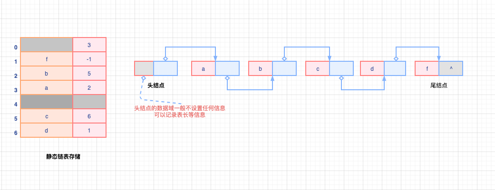

# 链式表示

```mindmap
root(链式表示)
    (单链表)
    (双链表)
    (循环链表)
    (静态链表)
```

顺序表的插入、删除操作需要移动大量元素，影响了运行效率（虽然时间复杂度为O(1)的情况也存在）。

**链式存储线性表时，不需要使用连续的存储单元，不要求逻辑上相邻的两个元素在物理位置上也相邻**

理解“链”的含义，链条--->捆绑、指向------>指针

**链式存储线性表时，对线性表的插入、删除元素是不需要移动元素的，只是需要修改指针**

## 单链表

```mindmap
root(单链表)
    (单链表)
    (头结点)
    (头插法)
    (尾插法)
    (按序号查找)
    (按值查找)
    (结点插入)
    (删除结点)
    (计算表长)
```

### 基本概念

线性表的链式存储称作`单链表`，通过**一组任意的存储单元**来存储线性表中的数据元素。

每个链表结点（node）除了存放元素自身的信息外，还需要存放一个指向其后继结点的指针。目的是：**通过指针建立起链表元素之间的线性关系**

单链表中结点类型的描述：

```cpp
// 单链表结点类型定义
typeof struct LNode{
    ElemType data;          // 数据域
    struct LNode *next;     // 指针域
}LNode , *LinkList;

```

单链表可以解决顺序表需要大量连续存储空间的缺点，但是单链表在数据域的基础上附加了指针域，存在浪费存储空间的缺点；

单链表的元素是**离散地分布**在存储空间中的，因此**单链表是非随机存取的存储结构**，不能直接找到表中特定的结点，需要从头开始遍历、一次查找；

通常，**头指针用来标识一个单链表**。头指针指向`NULL`时，标识单链表为空。

### 头结点

为了操作上的方便，在单链表第一个结点之前附加一个结点，叫做**头结点**。

- 头结点的数据域可以不存任何信息、也可以记录表长等基础信息
- 头结点的指针域指向线性表的第一个元素结点；

**不论单链表是否带头结点（可选），头指针始终指向链表的第一个结点。**

头结点是带头结点的链表中的第一个结点【重要】

- 头结点的数据域可以不存任何信息、也可以记录表长等基础信息
- 头结点的指针域指向线性表的第一个元素结点；

头结点的优点：

- 因为开始结点的位置被存放在头结点的指针域中，所以在链表的第一个位置上的操作和在表的其他位置上的操作一致，不需要进行特殊处理；
- 无论链表是否为空，头指针始终是指向头结点的头结点的非空指针【空表中，往往就只有头结点，此时头结点的指针域为空，可以有效避免头指针空指针异常问题】-----> **头结点的引入，很好的统一了空表和非空表的操作；**

### 头插法

> 从空表开始，生成新的结点，将读取的数据存放在新结点的数据域中，将新结点插入到当前链表的表头【头结点之后】

```cpp
/*
 * @Description: 单链表头插法创建
 * @Version: Beta1.0
 * @Author: 微信公众号：储凡
 * @Date: 2020-03-04 23:38:04
 * @LastEditors: 微信公众号：储凡
 * @LastEditTime: 2020-03-04 23:39:16
 */
LinkList CreateListWithStartNode(LinkList &L){

    LNode *s;
    int x;
    L=(LinkList)malloc(sizeof(LNode));  // 创建头结点L
    L->next=NULL;                       // 初始化空链表

    // 控制台输入值
    scanf("%d",&x);

    // 输入9999 表示结束
    while(x!==9999){
        // 开辟新结点存储空间
        s=(LNode*)malloc(sizeof(LNode));
        // 结点数据域赋值
        s->data=x;
        // 修改指针，新结点插入表中【注意：L->next为头结点的指针域】
        s->next=L->next;
        L->next=s;
        scanf("%d",&x);
    }

    // 返回单链表
    return L;
}

```

特点：

- 读入数据的顺序与生成的链表中的元素顺序是相反的【结合队列先进先出思考】
- 每个结点插入的时间复杂度为O(1),单链表长度为n时，头插法的时间复杂度为O(n)【结合算法中的while循环，可以很明确看出时间复杂度】

### 尾插法

头插法建立的单链表，链表中结点的次序和输入数据的顺序不一致【相反】，尾插法则很好的避免了这个问题；

> 新结点插入到当前链表的表尾上，必须增加一个尾指针r,始终指向当前链表的尾结点；

```cpp
/*
 * @Description: 单链表尾插法创建
 * @Version: Beta1.0
 * @Author: 微信公众号：储凡
 * @Date: 2020-03-04 23:38:04
 * @LastEditors: 微信公众号：储凡
 * @LastEditTime: 2020-03-04 23:39:16
 */
LinkList CreateListWithEndNode(LinkList &L){

    int x;              // 输入结点值
    L=(LinkList)malloc(sizeof(LNode));
    LNode *s;           // 新结点s
    LNode *r=L;         // r为尾指针

    // 控制台输入值
    scanf("%d",&x);

    while(x!==9999){
        // 开辟新结点存储空间
        s=(LNode *)malloc(sizeof(LNode));

        // 新结点s的数据域赋值为x
        s->data=x;
        // 单链表L的尾指针指向新的结点s
        r->next=s;

        // 指针r指向新的表尾结点
        r=s;

        scanf("%d",&x);
    }

    // 表尾指针置空【重要】
    r->next=NULL;

    // 返回单链表
    return L;

}

```

特点：

- 读入数据的顺序与生成的链表中的元素顺序完全一致
- 每个结点插入的时间复杂度为O(1),单链表长度为n时，尾巴插法的时间复杂度为O(n)【结合算法中的while循环，可以很明确看出时间复杂度】
- 相比头插法附设了一个指向表尾结点的指针，但时间复杂度与头插法相同

### 按序号查找

> 在单链表中从第一个结点出发，顺指针next域逐个往下搜索、遍历，直到找出第i个结点为止，否则返回最后一个结点指针域NULL

```cpp
/*
 * @Description: 单链表按序号查找
 * @Version: Beta1.0
 * @Author: 微信公众号：储凡
 * @Date: 2020-03-04 23:38:04
 * @LastEditors: 微信公众号：储凡
 * @LastEditTime: 2020-03-04 23:39:16
 */
LNode *GetElem(LinkList L,int i){
    int j=1;                  // 查询计数，初始为1
    LNode *p=L->next;         // 单链表头结点指针赋值给指针p

    // 第0个元素，则指向头结点，返回头结点
    if(i==0){
        // 头结点包含数据域和指针域
        return L;
    }

    // 不等于0，却小于1，则i为负数无效，直接返回NULL，查询结果空；
    if(i<1){
        return NULL;
    }

    // p存在且计数没有走到初始i的位置
    while(p&&j<i){

        // 指针后移
        p=p->next;

        // 计数标记+1
        j++;
    }

    // 注意： 当p不存在时， 跳出循环，p=NULL; 当p存在但是j大于等于i，跳出循环，返回查找的结果，返回p
    // 从跳出循环上来分析，p要么存在即：找到的结点元素，要么为空即NULL

    // 跳出循环，返回第i个结点的指针
    return p;

}
```

需要遍历（扫描）单链表，时间复杂度为：O(n)

### 按值查找

> 从单链表的第一个结点开始，从前往后依次比较表中个结点数据域的值，等于给定值e，则返回该结点的指针；若整个单链表【遍历完】中没有数据域值为e的结点，则返回NULL；

```cpp
LNode *LocateElem(LinkList L,ElemType e){

    // 指针【哨兵】
    LNode *p=L->next;
    // 从第1个结点开始查找数据域(data)为e的结点
    while(p!=NULL&&p->data!=e){
        // 无法匹配，指针后移
        p=p->next;
    }

    // 注意：p为NULL的时候，说明单链表已经遍历的尾结点了，跳出循环，没有找到目标结点；

    // 查找到第1个匹配的结点，跳出循环，返回结点指针
    return p;
    //
}

```

链表遍历无法匹配，会返回NULL,因为在尾结点无法匹配的时候，直接返回尾结点指针域

需要遍历（扫描）单链表，时间复杂度为：O(n)

### 结点插入

> 单链表中，将值为x的新结点插入到单链表的第i个位置上

- 第一步： 检查插入位置的合法性；
- 第二步： 找到待插入位置的前驱结点，即第（i-1）个结点；
- 第三部： 在前驱结点后插入新结点；

```cpp
    // 循环遍历，时间复杂度O(n)
    p=GetElem(L,i-1);

    // 移动指针，时间复杂度O(1)
    s->next=p->next;
    p->next=s;
```

结合上面的代码可以看出，将元素x插入到单链表L的第i个元素上，必须先找到单链表L的i个结点的前驱结点，即（i-1）的位置，需要采用`GetElem()`函数，按照序号查找；

如果返回的前驱结点不为空，则说明插入的位置i合法，否则位置非法，插入失败；

找到前驱结点p后，最重要的是移动指针，将新的结点s的指针域指向结点p的指针域，也就是s的指针域指向元素p的后继结点，第i个结点元素

原来的(i-1)位置上的元素，也就是前驱结点p的指针域则必须指向新的结点元素；

**上面的过程不能更换，避免后继指针不存在的问题**

最后的最后，一定要注意将s的数据域赋值x

插入结点的时间复杂度集中在查找第(i-1)个元素，时间复杂度为O(n);如果在给定结点的后面插入新结点，只需要执行`p->next=s`操作，时间复杂度为O(1)

#### 前插操作

> 在某结点的前面插入一个新的结点

**对结点的前插操作都可以转化为后插操作，前提：需要从单链表的头结点开始顺序查找到其前驱结点；时间复杂度为O(n)。**

#### 后插操作

> 在某结点的后面插入一个新的结点，单链表插入算法中，通常采用后插操作的

```cpp
// 结点s插入到结点p的前面，修改指针域，顺序不能改变
s->next=p->next;
p->next=s;

// 经典的借助变量，进行值交换
temp=p->data;
p->data=s->data;
s->data=temp;

```

上述借助临时变量`temp`来将结点s和结点p的数据域进行交换，需要开辟O(1)的空间复杂度，但是时间复杂度却从O(n)改变为O(1)，典型的空间换时间策略

### 删除结点

> 将单链表L的第i个结点元素删除；

- 第一步： 先检查删除位置的合法性；
- 第二步： 查找表中的第（i-1）个结点，即被删结点的前驱结点；
- 第三步： 移动指针，删除结点元素；

```cpp
// 获取删除位置结点元素的前驱结点
p=GetElem(L,i-1);

// 删除位置结点元素指针
q=p->next;

// 修改指针，将删除位置结点元素前驱结点的指针域指向其后继结点
p->next=q->next;

// 释放结点元素的内存控件
free(q)

```

和插入算法一样，时间都消耗在查询前驱结点上，时间复杂度为：O(n)

> 删除单链表L中给点结点元素\*p，通常是按值查找获取到p结点的前驱元素，再执行删除操作，这样很明显会导致时间复杂度为：O(n)，主要都消耗在`按值查找`上

这里可以利用p结点的后继结点将p结点删除

- 第一步：申请结点q，使其只想p结点的后继结点；
- 第二步：将p结点的数据域值换成其后继结点的数据域；【注意，交换没什么意义，最终p的后继结点会删除、释放】
- 第三步：p的指针域指向q的指针域，q结点从链中“断开”
- 第四步：释放q的内存空间

```cpp
    // 存放p的后继结点指针
    q=p->next;

    // 结点p的后继结点元素赋值给结点p，避免后继结点的数据域丢失
    p->data=p->next->data;
    p->next=q->next;

    // 此时q指向更换数据域后的p，即原来p的后继结点
    free(q)

```

相比按值查找前驱结点来删除给定的结点p，利用后继结点来删除的时间复杂度更小，为：O(1)

### 计算表长

> 计算单链表中数据结点（不含头结点）的个数

算法思路：从第一个结点开始顺序依次访问表中的每一个结点，为此需要设置一个`计数器变量`，每访问一个结点，计算器加1，直到访问到空结点为止。

算法时间复杂度：O(n)

**单链表的长度是不包括头结点的，不带头结点和带头结点的单链表在求表长操作上会略有不同。**

不带头结点的单链表，当表为空时候，需要单独处理；

```cpp
// 不带头结点的单链表L为空,判定条件是L=NULL。
if(L===NULL){
// 链表为空，表长为0
    return 0;
}

// 带头结点的单链表L为空，判空条件：L->next=NULL;

if(L->next===NULL){
    // 链表为空，不包含头结点，表长为0
    return 0;
}

```

## 双链表

```mindmap
root(双链表)
    (基本特点)
    (插入结点)
    (删除结点)
```

从单链表的结构上来看

- 访问特定结点的前驱结点需要遍历整个单链表，移动指针，时间复杂度为：O(n)
- 访问特定结点的后继结点只需要移动一次指针，时间复杂度为：O(1)

双链表的引入，很好的解决单链表访问前驱结点时间消耗大的问题。

双链表结点由三部分组成：

- `数据域` 存放数据信息
- `prior指针域` 指向结点的前驱结点
- `next指针域` 指向结点的后继结点

```cpp
// 双链表结点类型
typedef struct DNode{
    ElemType data;          // 结点的数据域
    struct DNode *prior;    // 结点的前驱指针
    struct DNode *next;     // 结点的后继指针
}DNode, *DlinkList;

```

### 基本特点

- 双链表仅仅在单链表的结点中增加了一个指向结点前驱的`prior`指针；
- `按值查找`、`按序号查找`在单链表和双链表上的操作是相同的。
- 和单链表不同，`插入`、`删除`操作除了修改`next`指针域，双链表还需要修改`prior`指针域，确保不断`链`，时间复杂度都为：O(1)

### 插入结点

> 在双链表中p所指的结点之后插入结点s

```cpp
// 第一步
s->next=p->next;

// 第二步
p->next->prior=s;

// 第三步
s->prior=p;

// 第四步
p->next=s

```

**第一步和第二步必须再第四步之前**，整体时间复杂度为：O(1)

### 删除结点

> 删除双链表中结点p的后继结点q

```cpp
// 第一步
p->next=q->next;

// 第二步
q->next->prior=p;

// 第三步
free(q);

```

**第一步和第二步顺序可换**，整体时间复杂度为：O(1)

## 循环链表

```mindmap
(循环链表)
    (循环单链表)
        (判空条件)
        (基本特点)
    (循环双链表)
        (判空条件)
        (基本特点)

```

### 循环单链表

`循环单链表`是在单链表的基础上，将最后一个结点（尾结点）的指针由`NULL`改为指向`头结点`，形成`环`。【单链表----->循环单链表】

```cpp
// 双链表结点类型
typedef struct DNode{
    ElemType data;          // 结点的数据域
    struct DNode *prior;    // 结点的前驱指针
    struct DNode *next;     // 结点的后继指针
}DNode, *DlinkList;

```

#### 判空条件

**不是判断头结点的指针是否为空，而是需要判断是否等于头指针**，表为空时，头结点的next指针域其实是指向自己；

#### 特点

- 在循环单链表中，尾结点\*p的next指针域指向链表L（即：头结点），形成了`闭环`,不存在指针域为`NULL`的结点。
- **由于循环单链表是个`环`,在任何位置上的插入、删除操作都是等价的，不需要去判断是否是表尾**。当其中的结点的next指针指向自己，也就能判断表为空
- 单链表只能从头结点（表头结点）开始往后顺序遍历整个表，循环单链表可以从表中任意位置开始遍历整个链表，结点是等价的；
- **循环单链表可以抽象为时钟，形成的`环`是有顺序的；**
- 频繁的`表头`和`表尾`操作，可以对循环单链表设置`尾指针`，而不设置`头指针`，明确尾指针r后，头指针即为：`r->next` ，减少头指针到尾指针间的遍历，时间复杂度:O(n)---->O(1)

### 循环双链表

`循环双链表`是在双链表的基础上，将`尾结点`的`next`指针指向`头结点`，将`头结点`的`prior`指针指向`尾结点`。【双链表----->循环双链表】

```cpp
// 双链表结点类型
typedef struct DNode{
    ElemType data;          // 结点的数据域
    struct DNode *prior;    // 结点的前驱指针
    struct DNode *next;     // 结点的后继指针
}DNode, *DlinkList;

```

#### 判空条件

循环双链表为空时，头结点\*p的prior指针和next指针都指向L，即同时满足：

- p->next=L
- p->prior=L

#### 基本特点

- 从双向链表中的任意一个结点开始，都可以很方便地访问它的`前驱结点`和`后继结点`。

## 静态链表



> 借助数组来描述线性表的链式存储结构，结点元素同样存在数据域`data`和指针域`next`

注意： 和普通的链表的指针域不同的是，静态链表的指针是结点元素的相对地址(数组下标)，也称为`游标`，建议结合高级语言中数组的概念来理解；

**与顺序表一样，虽然静态链表属于链表，但是存储时需要预先分配一块连续的内存空间**

静态链表结构类型：

```cpp
// 定义静态链表的最大长度
# define MaxSize 50

typedef struct{
    ElemType data;      // 存储数据元素，数据域
    int next;           // 下个元素的相对地址，数组下标
}SLinkList[MaxSize];

```

很显然，静态链表是通过`数组游标`来访问下一个结点元素，可以和`指针域`的相关概念结合理解；

- 静态链表以`next=-1`作为结束的标志【尾结点】
- 和动态链表相同，**插入、删除操作不需要移动元素，只需要修改指针**；
- 总体来说，静态链表没有单链表使用方便，需要将整个链表存储在一块连续的内存空间中，内部的存储可以分散，通过指针构成`链`的关系
