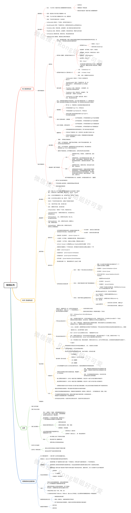

# 栈和队列

### 主要内容

- [栈的基本概念和基本操作](1.栈的基本概念和基本操作.md)
- [栈的顺序存储结构](2.栈的顺序存储结构.md)
- [栈的链式存储结构](3.栈的链式存储结构.md)
- [队列的基本概念和基础操作](4.队列的基本概念和操作.md)
- [队列的顺序存储](5.队列的顺序存储结构.md)
- [队列的链式存储](6.队列的链式存储结构.md)
- [栈和队列的应用](7.栈和队列的应用.md)
- [特殊矩阵的压缩存储](8.特殊矩阵的压缩存储.md)

