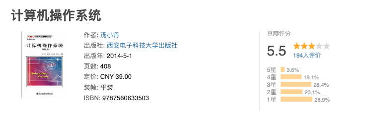
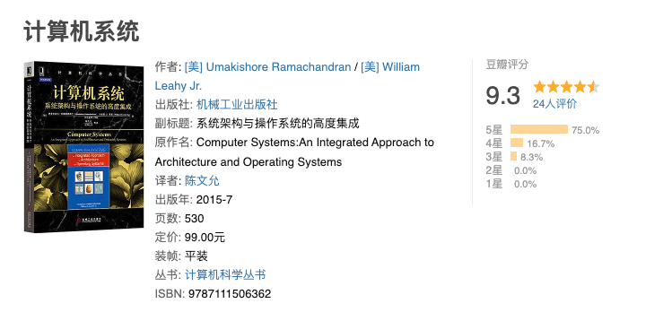

# 操作系统

## 系统概述

- 引论
- 发展和分类
- 运行环境
- 体系结构

## 进程管理

- 进程和线程
- 处理机调度
- 进程同步
- 死锁

## 内存管理

- 引论
- 虚拟内存
- 一些总结

## 文件管理

- 基本概念
- 文件系统
- 磁盘管理
- 一些总结

## 输入、输出管理

- 基本概述
- 核心子系统
- 高速缓存和缓冲区
- 一些总结

## 参考资料

- 《计算机操作系统》 第四版 汤小丹、梁红兵、汤子瀛著
- 《操作系统-王道考研》 2019 王道论坛
