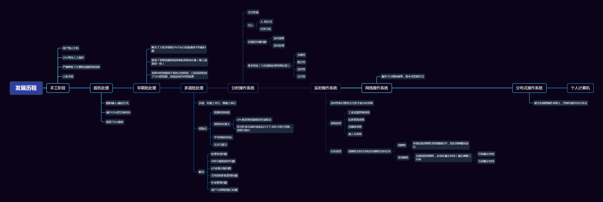

# 操作系统引论

## 目标和作用

> 操作系统（Operating System）是配置在计算机硬件上的第一层软件，是对硬件系统的首次扩充。主要作用是管理好硬件设备，提高硬件设备的利用率的系统吞吐量，并为用户和应用程序提供简单的接口，便于用户使用。**操作系统是现在计算机系统中最基本和最重要的系统软件**

### 目标

> 方便性、有效性、可扩充性、开放性

#### 方便性

未配置操作系统(OS)的计算机系统必然是极难使用，不适合大多数人的，当用户需要在计算机硬件（裸机）上运行自己写的程序，就必须使用到机器语言。倘若计算机硬件配置了OS，系统便可以使用编译命令将用户采用高级语言（Java、C、C++等）编写的程序翻译成机器可执行代码，亦或通过OS所提供的各种命令来操作计算机系统，从而极大的方便用户，计算机也能更加易于使用和学习；

#### 有效性

操作系统的有效性包含的第一层含义是**提高系统资源的利用率**，同时，提高系统资源利用率也是推动OS发展最主要的动力；

另一层含义是**提高系统的吞吐量**，操作系统可以通过合理地组织计算机的工作流程， 加速程序的运行，速断程序的运行周期，以此来提高系统的吞吐量；

**方便性和有效性是设计OS时最重要的两个目标**

#### 可扩充性

为适应计算机硬件、体系结构以及计算机应用发展的要求，操作系统必须具有很好的可扩充性。然而操作系统的可扩充性好坏与OS的结构有着十分紧密的联系。正是因为如此，操作系统的发展也推动着操作系统接口的不断发展；

无结构系统------>模块化结构----->层次化结构----->微内核结构

#### 开放性

随着Internet的快速发展，计算机操作系统的应用环境也由单机环境转向了网络环境，应用环境需要更加的开放，因此对操作系统的开放性提出了更高的要求；

所谓开放性，即指系统能遵循世界标准规范，特别是遵循开放系统互连OSI国际标准；而事实上，方式遵循国际标准所开发的硬件和软件，都能够彼此兼容，方便实现互连。开放性是衡量一个新推出的系统或者软件能否被广泛应用的至关重要的因素

### 作用

> 操作系统在计算机系统中所起的作用，可以从用户、资源管理、资源抽象等不通维度去分析和讨论
>
> - 作为用户与计算机硬件系统的接口
> - 作为计算机系统资源的管理者
> - 实现对计算机资源的抽象

#### 作为用户与计算机硬件系统的接口

操作系统作为用户与计算机硬件与系统之间接口的含义：**操作系统处于用户与计算机硬件系统之间，用户通过OS来使用计算机系统**，即：用户在操作系统的帮助下能够方便、快捷、可靠地操作计算机硬件和运行自己的程序。

从下图中可以看出，用户可以通过三种方式操作使用计算机

- 命令
- 系统调用
- 图标-窗口可视化

#### 作为计算机系统资源的管理者

操作系统的主要功能是管理多种硬件和软件资源，归纳起来分为：

- 处理机
- 存储器
- I/O设备
- 文件（数据和程序）

四部分各司其职，同时操作系统必须为使用资源的请求进行**授权**，协调多用户对共享资源的使用，**避免发生冲突**；

- 处理机管理用于分配和控制处理机
- 存储器管理主要负责内存的分配和回收
- I/O设备管理是I/O设备的分配（回收）与操作
- 文件管理是用于实现对文件的存取、共享和保护

#### 实现对计算机资源的抽象

从裸机（完全无软件的计算机系统）来看，仅仅向用户提供硬件接口（物理接口），用户必须对物理接口实现的细节有充分的了解，导致物理节气很难被广泛使用。**为了能够方便用户使用I/O设备，人们需要在裸机上覆盖一层I/O设备管理软件，借助I/O设备软件来实现对I/O设备操作的细节，并且需要向上将I/O设备抽象为一组数据结构以及一组操作命令（例：read命令、write命令）。使得用户通过利用这些数据结构及操作命令来进行数据输入和输出，不需要关系I/O设备在硬件上是如何实现的。**

> 在裸机上铺设的I/O软件隐藏了I/O设备的具体细节，向上提供了一组抽象的I/O设备

通常，将覆盖上述软件（I/O软件、物理接口、硬件）的机器成为`扩充机`或`虚拟机`,向用户提供一个对硬件操作的抽象模型。**I/O设备管理软件实现了对计算机硬件操作的第一层次的抽象；**

**操作系统是铺设在计算机硬件上的多层软件的集合，不仅增强了系统的功能，还隐藏了对硬件操作的具体细节，实现了对计算机硬件操作的多个层次的抽象模型。需要说明的是，不仅仅可以在底层对硬件资源加以抽象，还可以在高层对该资源底层已抽象的模型再次进行抽象，成为更加高层的抽象模型。**

> 随着抽象层次的提高，抽象接口所提供的功能也就越强，用户使用起来也越方便。

### 推动操作系统发展的主要动力

> 操作系统自20世纪50年代诞生后，经历了简单到复杂、低级到高级的发展，在60多年的时间里，操作系统在各方面都有长足的进步，能够很好的适应计算机硬件和体系结构的快速发展，以及应用需求下的不断变化。

主要推动力：

- 不断提高的计算机资源利用率
- 方便用户
- 器件的不断更新换代
- 计算机体系结构的不断发展
- 不断提出新的应用需求

### 操作系统的概念

在信息化是戴，软件被称作为计算机系统的灵魂，作为软件核心的操作系统，已经与现代计算机系统密不可分，融为一体。自下而上可错略的分为：硬件、操作系统、应用软件、用户（与组成原理中的分层不同）。**操作系统管理各种计算机硬件，为应用程序提供基础，并充当计算机硬件与用户之间的中介。控制和协调各用户的应用程序对硬件的分配和使用**

### 操作系统的定义

> 操作系统（Operating System，OS）指控制和管理整个计算机系统的硬件和软件资源，并合理地组织调度计算机的工作和资源的分配，提供给用户和其他软件方便的接口和环境的程序集合。是最基础的系统软件

## 操作系统的发展过程

> 在20世纪50年代中期，出现了第一个简单的批处理操作系统；
>
> 60年代中期开发出多道程序批处理操作系统；
>
> 不久后，推出了分时操作系统，与此同时，用于工业 和武器控制的实时操作系统相继出现；
>
> 20世纪70到90年代，成为VLSI（超大规模集成电路）和计算机体系结构发展的年代，微型机、多处理机和计算机网络诞生并发展

### 操作系统发展历程

#### 手工操作阶段

首先明确，此阶段无操作系统；操作方式是由程序员将事先已经穿孔的纸带（卡片），装入纸带输入机（卡片输入机），在启动它们将纸带或者卡片上的程序和数据输入计算机。然后才能启动计算机运行。**仅当程序运行完毕并且取走结果后，才能允许下一个用户上机**，即存在着：程序装入、运行、结果的输出等操作。随着计算机硬件的快速发展，人机矛盾（处理速度和资源利用的矛盾）突显严重，从而促进操作系统的发展，寻求新的解决方法；

手工操作阶段有着明显的缺点：

- 用户独占主机（一台计算机的全部资源由上机用户所独占），不会出现因资源已经被其他用户占用而等待的现象，但是资源利用率低；
- CPU等待手工操作，CPU及内存等资源是空闲的，资源利用也不充分

由于上面两个突显的缺点，**人工操作的方式严重降低了计算机资源的利用率，包括软件和硬件资源，即人机矛盾；** 虽然CPU 的速度在迅速提高，但是I/O设备的比速度却提高 缓慢，使得CPU与I/O设备之间速度不匹配问题更加突出。**唯一的解决办法就是用高速的机器代替相对较慢的手工操作来对作业进行控制。** 先后出现过通道技术、缓冲技术、脱机输入/输出技术

#### 脱机处理阶段

为了能够充分地提高计算机的利用率，应该尽量的保持系统连续的运行，即在处理完一个作业任务后，紧接着处理下一个作业，减少机器空闲等待时间；

从上面的流程图中可以看出，单道批处理系统在解决人机矛盾和CPU与I/O设备速度不匹配矛盾的过程中形成的。**也可以理解为批处理系统的首要目的是在提高系统资源的利用率和系统吞吐量**。系统对作业的处理是成批进行的，内存中始终只能保存一道作业任务；

单道批处理系统的显著特征：

- **自动性** 在顺序的情况下，在磁带上的一批作业任务能够自动地逐个依次有序运行，不需要人工干预；
- **顺序性** 各道作业都是顺序进入内存中，完成的顺序和进入内存顺序，在正常情况下是完全相同的。可以理解为类似队列的方式，先调入内存的作业先完成；
- **单道性** 内存中仅仅只有一道程序运行，监督程序每次从磁带上只调用一道程序进入内存运行。只有当程序完成或者发生异常时，才会更换后续程序进入内存中；

单道批处理系统主要的缺点是：**系统中的资源得不到充分的利用**，程序在运行中发出I/O请求后，CPU便会处于等待状态，即：CPU空闲，同样也会造成内存的浪费；

#### 多道批处理系统

允许多个程序同时进入到内存并且运行。即同时会把多个程序放入内存，允许在CPU中交替运行。**共享系统中各种软件、硬件资源**。当一道程序因为I/O请求而暂停运行，CPU可以立即转去运行另外一道程序。最大程度的让系统的各个组成部分都“动起来”、“忙起来”,花费很少的时间去切换任务。实现系统各部件之间**并行工作，提高效率**；

多道程序设计的特点：**多道、宏观上并行、微观上串行**

> 多道：计算机内存中同时存放多个相互独立的程序；
>
> 宏观上并行：同时进入系统到的多道程序都处于运行过程中，先后开始了各自的运行，但是都处于运行中，没有运行完毕；
>
> 微观上串行：内存中的多道程序轮流占有CPU资源，交替进行；

多道程序设计计算实现需要解决的问题：

- 如何分配处理器
- 多道程序的内存分配问题
- I/O设备如何分配
- 如何组织和存放大量的程序和数据，便于用户使用和保证其安全性与一致性

**在批处理系统中采用多道程序设计技术，就形成了多道批处理操作系统**。由作业调度程序自动地选择作业运行；

多道批处理系统的优缺点：

- **资源利用率高**
- **系统吞吐量大**

  - CPU和其他资源保持“忙碌”状态（主要原因）；
  - 仅仅当作业完成时或者运行不下去时才进行切换，系统开销小（主要原因）；

- **平均周转时间长** 需要排队依次处理，响应时间长
- **无交互能力** 修改和调试程序极其不方便，用户既不能了解程序的运行情况，也不能控制计算机；

#### 分时系统

> 推动多道批处理系统形成和发展的主要动力是**提高资源利用和系统吞吐量**；推动分时系统形成和发展的主要动力是**满足用户对人机交互的需求**，即满足：**人-机交互、共享主机**

分时系统定义：**在一台主机上连接了多个配有显示器和键盘的终端并由此组成的系统，允许多个用户同时通过自己的终端，以交互的方式使用计算机，共享主机中的资源**；

分时技术定义： 把处理器的运行时间分成很短的时间片，按照时间片轮转把处理器分配给各个联机作业使用。若某个作业在分配给它的时间片内不能完成计算，则该作业暂时停止运行，把处理器让给其他作业，等待下一轮再继续运行。**由于计算机速度很快，作业运行轮转也很快，给每个用户的实际的感觉就好像是独占一台计算机**

> 如何使用户能与自己的作业进行交互，是实现分时系统最关键的问题，需要处理好及时接收、及时处理的问题。

- 及时接收：可以通过在系统中配置多路卡，通过多路卡实现分时多路复用
- 及时处理：关键是实现人-机交互，用户输入命令后 ，能够对自己的作业及其运行及时地**实施控制**或者**进行修改**。需要各用户的作业都必须驻留在内存中，并且可以频繁地获得处理机运行。推荐采用：**作业直接进入内存**或者**时间片轮转方式**

> 时间片简单解释：
>
> 一个时间片就是一段很短的时间，系统规定每个作业每次只能运行一个时间片，然后就暂停该作业的运行，通过调度算法立即调度到下一个作业运行。使得每个用户都能及时地与自己的作业进行交互，用户的请求得到及时的响应

**主要特征**

> 与多道批处理系统相比，分时系统具有非常明显的特性，包含：多路性、独立性、及时性、交互性

- **多路性** 也可以叫做同时性，允许多个终端同时使用一台计算机（即：一台计算机与若干的终端相连接，终端上的用户可以同时或者基本同时使用计算机）
- **独立性** 系统中的多个用户可以彼此独立地进行操作，互不干扰，就像单独操作计算机一样，自我感觉为一人独用
- **及时性** 用户的请求能够在很短时间（用户能够接收的时间间隔）内获得响应
- **交互性** 用户能够方便地与系统进行人-机交互对话，用户通过终端采用人-机交互的方式控制程序运行调度，与程序进行交互

> 理解好交互对话中对话的含义，不是说像日常人们之间言语的对话，是通过人的操作来获取程序的响应，像领导发号命令会及时响应；
>
> **分时操作系统较好的解决人-机交互问题**

#### 实时系统

> 为了能够在某个时间限制内完成某些紧急任务而不需要进行时间片排队 ，诞生了**实时操作系统**，时间限制有两种情况：
>
> - 硬实时系统 规定某个动作必须绝对地在规定的时刻（或者规定的时间范围）发生
> - 软实时系统 能够接受偶尔违反时间规定，并且不会引起任何永久性的损害
>
> 上面两种情况，可以类比公司的上班只读：硬实时----->打卡上班，讲究KPI ，软实时------>扁平管理，推崇OKR

在实时操作系统的控制下，计算机系统受到外部信号后及时进行处理，并且要在严格限制内完成接收的时间。**实时操作系统的主要特点是及时性和可靠性**

**实时系统的类型**

- 工业（武器）控制系统
- 信号查询系统
- 多媒体系统
- 嵌入式系统

**实时任务的类型**

> 关于截止时间（DeadLine）也叫最后期限的理解：
>
> 1.开始截止时间，指某任务在某时间以前必须开始执行
>
> 2.完成截止时间，指某项任务在某时间以前必须完成

- 周期性实时任务和非周期性实时任务
- 硬实时任务和软实时任务

## 操作系统的基本特性

> 例如批处理系统 有高资源利用率和系统吞吐量特点，分时系统能够获得及时响应，实时系统具有实时的特征。横向比较，不同操作系统之间功能具有**并发、共享、虚拟、异步**的基本特征

### 并发(Concurrence)

> 并发是指两个或者多个事件在**同一事件间隔**内发生。而并行是指两个或多个事件在**同一时刻**发生

在多道程序环境下，一段时间内宏观上有多道程序在同时执行，而在每一时刻，单处理机环境下实际仅仅能有一道程序在执行。因此，**微观上程序还是在分时地交替执行**，操作系统的并发性是通过分时去实现的。

在操作系统中，引入进程的目的就是为了让程序能够并发的执行，多个进程之间可以鬓发执行和交换信息

> 进程：在系统中能独立运行并作为**资源分配的基本单位**，由一组机器指令、数据和堆栈等组合而成，是一个能独立运行的活动实体

### 共享（Sharing）

### 虚拟（Virtual）

### 异步（Asynchronism）

## 操作系统的主要功能

> 为了能够给多道程序提供良好的运行环境，操作系统应该具有：处理机管理、存储器管理、设备管理、文件管理的功能，同时方便用户使用操作系统，还必须提供接口。
>
> 引入操作系统的主要目的：为多道程序的运行提供良好的运行环境，保证多道程序能够有条不紊地、高效地运行，最大程度的提高系统中各种资源的利用率

## 操作系统的结构设计
