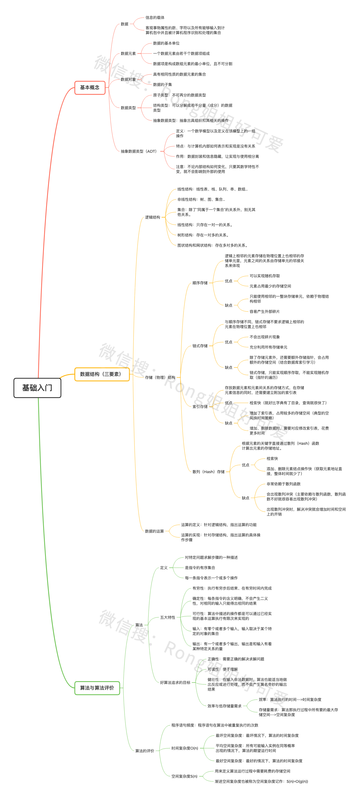

<!--
 * @Description: 数据结构——基础入门
 * @Version: Beta1.0
 * @Author: 【B站&公众号】Rong姐姐好可爱
 * @Date: 2021-03-22 07:59:20
 * @LastEditors: 【B站&公众号】Rong姐姐好可爱
 * @LastEditTime: 2021-03-22 08:02:01
-->

## 基础入门

### 主要内容

- [基础概念](1.基础概念.md)
- [数据结构三要素](2.数据结构三要素.md)
- [算法与算法评价](3.算法和算法评价.md)

