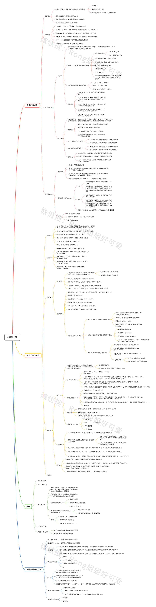

<!--
 * @Description: 数据结构-栈和队列
 * @Version: Beta1.0
 * @Author: 【B站&公众号】Rong姐姐好可爱
 * @Date: 2021-03-22 08:02:29
 * @LastEditors: 【B站&公众号】Rong姐姐好可爱
 * @LastEditTime: 2021-03-22 08:02:43
-->

## 栈和队列

### 主要内容

- [栈的基本概念和基本操作](1.栈的基本概念和基本操作.md)
- [栈的顺序存储结构](2.栈的顺序存储结构.md)
- [栈的链式存储结构](3.栈链式存储结构.md)
- [队列的基本概念和基础操作](4.队列的基本概念和基础操作.md)
- [队列的顺序存储](5.队列的顺序存储结构.md)
- [队列的链式存储](6.队列的链式存储结构.md)
- [栈和队列的应用](7.栈和队列的应用.md)
- [特殊矩阵的压缩存储](8.特殊矩阵的压缩存储.md)

