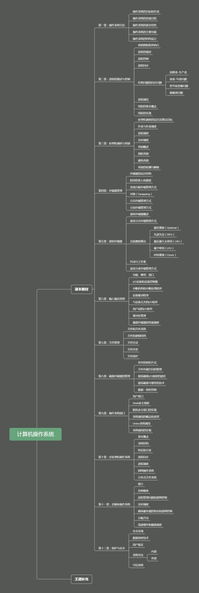

## 思维导图

>  内容同步与文档，可以结合思维导图对文档进行有效学习
>
>  创建时间：2020年4月9日

## 目录内容（善用Ctrl+F）

> 计算机操作系统的相关基础知识主要依托《计算机操作系统》第四版内容进行整理，后续会结合王道考研书进行扩展补充
>
> 参考资料:
>
> 1. 《计算机操作系统》 第四版  汤小丹、梁红兵、汤子瀛著
> 2. 《操作系统-王道考研》 2019 王道论坛

### 计算机操作系统

- [第一章：操作系统引论](第一章 操作系统引论.md) 
- [第二章：进程的描述与控制]()
- [第三章：处理机调度与死锁]()
- [第四章：存储器管理]()
- [第五章：虚拟存储器]()
- [第六章：输入输出系统]()
- [第七章：文件管理]()
- [第八章：磁盘存储器的管理]()
- [第九章：操作系统接口]()
- [第十章：多处理机操作系统]()
- [第十一章：多媒体操作系统]()
- [第十二章：保护与安全]()

### 王道论坛