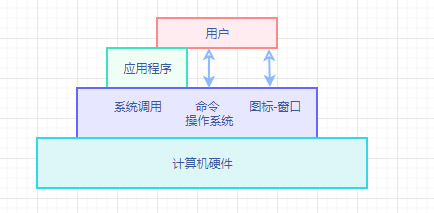

## 操作系统的目标和作用

> 操作系统（Operating System）是配置在计算机硬件上的第一层软件，是对硬件系统的首次扩充。主要作用是管理好硬件设备，提高硬件设备的利用率的系统吞吐量，并为用户和应用程序提供简单的接口，便于用户使用。**操作系统是现在计算机系统中最基本和最重要的系统软件**

### 操作系统的目标

> 方便性、有效性、可扩充性、开放性

#### 方便性

未配置操作系统(OS)的计算机系统必然是极难使用，不适合大多数人的，当用户需要在计算机硬件（裸机）上运行自己写的程序，就必须使用到机器语言。倘若计算机硬件配置了OS，系统便可以使用编译命令将用户采用高级语言（Java、C、C++等）编写的程序翻译成机器可执行代码，亦或通过OS所提供的各种命令来操作计算机系统，从而极大的方便用户，计算机也能更加易于使用和学习；

#### 有效性

操作系统的有效性包含的第一层含义是**提高系统资源的利用率**，同时，提高系统资源利用率也是推动OS发展最主要的动力；

另一层含义是**提高系统的吞吐量**，操作系统可以通过合理地组织计算机的工作流程， 加速程序的运行，速断程序的运行周期，以此来提高系统的吞吐量；

**方便性和有效性是设计OS时最重要的两个目标**

#### 可扩充性

为适应计算机硬件、体系结构以及计算机应用发展的要求，操作系统必须具有很好的可扩充性。然而操作系统的可扩充性好坏与OS的结构有着十分紧密的联系。正是因为如此，操作系统的发展也推动着操作系统接口的不断发展；

无结构系统------>模块化结构----->层次化结构----->微内核结构

#### 开放性

随着Internet的快速发展，计算机操作系统的应用环境也由单机环境转向了网络环境，应用环境需要更加的开放，因此对操作系统的开放性提出了更高的要求；

所谓开放性，即指系统能遵循世界标准规范，特别是遵循开放系统互连OSI国际标准；而事实上，方式遵循国际标准所开发的硬件和软件，都能够彼此兼容，方便实现互连。开放性是衡量一个新推出的系统或者软件能否被广泛应用的至关重要的因素

### 操作系统的作用

> 操作系统在计算机系统中所起的作用，可以从用户、资源管理、资源抽象等不通维度去分析和讨论
>
> - 作为用户与计算机硬件系统的接口
> - 作为计算机系统资源的管理者
> - 实现对计算机资源的抽象

#### 作为用户与计算机硬件系统的接口

操作系统作为用户与计算机硬件与系统之间接口的含义：**操作系统处于用户与计算机硬件系统之间，用户通过OS来使用计算机系统**，即：用户在操作系统的帮助下能够方便、快捷、可靠地操作计算机硬件和运行自己的程序。

从下图中可以看出，用户可以通过三种方式操作使用计算机

- 命令
- 系统调用
- 图标-窗口可视化

#### 作为计算机系统资源的管理者

操作系统的主要功能是管理多种硬件和软件资源，归纳起来分为：

- 处理机
- 存储器
- I/O设备
- 文件（数据和程序）

四部分各司其职，同时操作系统必须为使用资源的请求进行**授权**，协调多用户对共享资源的使用，**避免发生冲突**；

- 处理机管理用于分配和控制处理机
- 存储器管理主要负责内存的分配和回收
- I/O设备管理是I/O设备的分配（回收）与操作
- 文件管理是用于实现对文件的存取、共享和保护

#### 实现对计算机资源的抽象

从裸机（完全无软件的计算机系统）来看，仅仅向用户提供硬件接口（物理接口），用户必须对物理接口实现的细节有充分的了解，导致物理节气很难被广泛使用。**为了能够方便用户使用I/O设备，人们需要在裸机上覆盖一层I/O设备管理软件，借助I/O设备软件来实现对I/O设备操作的细节，并且需要向上将I/O设备抽象为一组数据结构以及一组操作命令（例：read命令、write命令）。使得用户通过利用这些数据结构及操作命令来进行数据输入和输出，不需要关系I/O设备在硬件上是如何实现的。**

> 在裸机上铺设的I/O软件隐藏了I/O设备的具体细节，向上提供了一组抽象的I/O设备

通常，将覆盖上述软件（I/O软件、物理接口、硬件）的机器成为`扩充机`或`虚拟机`,向用户提供一个对硬件操作的抽象模型。**I/O设备管理软件实现了对计算机硬件操作的第一层次的抽象；**

**操作系统是铺设在计算机硬件上的多层软件的集合，不仅增强了系统的功能，还隐藏了对硬件操作的具体细节，实现了对计算机硬件操作的多个层次的抽象模型。需要说明的是，不仅仅可以在底层对硬件资源加以抽象，还可以在高层对该资源底层已抽象的模型再次进行抽象，成为更加高层的抽象模型。**

> 随着抽象层次的提高，抽象接口所提供的功能也就越强，用户使用起来也越方便。

### 推动操作系统发展的主要动力

> 操作系统自20世纪50年代诞生后，经历了简单到复杂、低级到高级的发展，在60多年的时间里，操作系统在各方面都有长足的进步，能够很好的适应计算机硬件和体系结构的快速发展，以及应用需求下的不断变化。

主要推动力：

- 不断提高的计算机资源利用率
- 方便用户
- 器件的不断更新换代
- 计算机体系结构的不断发展
- 不断提出新的应用需求

### 操作系统的概念

在信息化是戴，软件被称作为计算机系统的灵魂，作为软件核心的操作系统，已经与现代计算机系统密不可分，融为一体。自下而上可错略的分为：硬件、操作系统、应用软件、用户（与组成原理中的分层不同）。**操作系统管理各种计算机硬件，为应用程序提供基础，并充当计算机硬件与用户之间的中介。控制和协调各用户的应用程序对硬件的分配和使用**

### 操作系统的定义

>操作系统（Operating System，OS）指控制和管理整个计算机系统的硬件和软件资源，并合理地组织调度计算机的工作和资源的分配，提供给用户和其他软件方便的接口和环境的程序集合。是最基础的系统软件

## 操作系统的发展过程

> 在20世纪50年代中期，出现了第一个简单的批处理操作系统；
>
> 60年代中期开发出多道程序批处理操作系统；
>
> 不久后，推出了分时操作系统，与此同时，用于工业 和武器控制的实时操作系统相继出现；
>
> 20世纪70到90年代，成为VLSI（超大规模集成电路）和计算机体系结构发展的年代，微型机、多处理机和计算机网络诞生并发展

### 操作系统发展历程

#### 手工操作阶段

首先明确，此阶段无操作系统；操作方式是由程序员将事先已经穿孔的纸带（卡片），装入纸带输入机（卡片输入机），在启动它们将纸带或者卡片上的程序和数据输入计算机。然后才能启动计算机运行。**仅当程序运行完毕并且取走结果后，才能允许下一个用户上机**，即存在着：程序装入、运行、结果的输出等操作。随着计算机硬件的快速发展，人机矛盾（处理速度和资源利用的矛盾）突显严重，从而促进操作系统的发展，寻求新的解决方法；

手工操作阶段有着明显的缺点：

- 用户独占主机（一台计算机的全部资源由上机用户所独占），不会出现因资源已经被其他用户占用而等待的现象，但是资源利用率低；
- CPU等待手工操作，CPU及内存等资源是空闲的，资源利用也不充分

由于上面两个突显的缺点，**人工操作的方式严重降低了计算机资源的利用率，包括软件和硬件资源，即人机矛盾；**虽然CPU 的速度在迅速提高，但是I/O设备的比速度却提高 缓慢，使得CPU与I/O设备之间速度不匹配问题更加突出。**唯一的解决办法就是用高速的机器代替相对较慢的手工操作来对作业进行控制。**先后出现过通道技术、缓冲技术、脱机输入/输出技术

#### 脱机处理阶段

## 操作系统的基本特性

## 操作系统的主要功能

## 操作系统的结构设计

